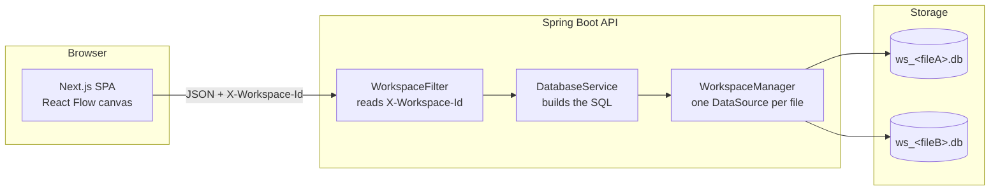

# 📊 SQL Visualizer

Import a `.csv` or `.sql` file, watch its schema appear as an interactive entity-relationship
diagram, edit the tables and rows directly on the canvas, and export the result back out as SQL or
CSV.

Built with **Spring Boot 3.3 (Java 17)** on the backend and **Next.js 16** on the frontend.

| | |
|---|---|
| **Live frontend** | https://db-viewer-ui-srivatsa.azurewebsites.net |
| **Live API** | https://db-viewer-api-srivatsa.azurewebsites.net |
| **API docs (Swagger)** | https://db-viewer-api-srivatsa.azurewebsites.net/swagger-ui.html |

---

## 📑 Table of contents

- [What it does](#-what-it-does)
- [How it works](#-how-it-works)
- [Repository layout](#-repository-layout)
- [Tech stack](#-tech-stack)
- [Prerequisites](#-prerequisites)
- [Quick start](#-quick-start)
- [Running against MySQL](#-running-against-mysql)
- [Configuration reference](#-configuration-reference)
- [API reference](#-api-reference)
- [Testing and quality gates](#-testing-and-quality-gates)
- [Deployment](#-deployment)
- [Documentation map](#-documentation-map)
- [Troubleshooting](#-troubleshooting)

---

## ✨ What it does

| Feature | Detail |
|---|---|
| **📂 CSV / SQL import** | Upload a `.csv` (types are inferred per column, a primary key is added if absent) or a `.sql` script. Nothing is created until you have seen what it would create — see **Pre-flight import** below. |
| **🗣️ Multi-dialect SQL** | A dump written for **MySQL, MariaDB, PostgreSQL or SQL Server** is detected by its own fingerprints and translated: vendor types are mapped, `SERIAL` / `IDENTITY(1,1)` / `AUTO_INCREMENT` all become a working key, `ALTER TABLE` keys and foreign keys are folded back into the `CREATE TABLE`, `GO` batches and pg_dump `COPY ... FROM stdin` blocks are understood. Anything that cannot be represented is skipped with a note rather than failing the import. |
| **🛫 Pre-flight import** | An import is staged, not executed on drop. `POST /import/analyze` parses the file and creates nothing; a dialog shows the tables, the inferred types, *why* each was chosen and real sample values, and lets you correct any of them before the DDL runs. The type this exists for is a postcode column of `01234` — all digits, so the obvious answer is `INT`, and the leading zeros would be gone for good. |
| **🗂️ Independent files** | Every SQL file you open is backed by its own database. Two files can each define a `users` table with different columns, and neither can see the other's data. |
| **🕸️ Schema visualization** | A React Flow entity-relationship canvas, drawn from live database metadata — drag nodes to arrange, zoom, and pan. |
| **🔗 Relationships** | Declared foreign keys are drawn as **orthogonal edges that route around the tables in the way**, rather than diagonals through them. Handles come from the relationship list, with `id` / `*_id` naming as a fallback. Primary keys are gold and foreign keys blue, in both themes. |
| **🧭 Canvas navigation** | A minimap for the parts of a large schema that are off screen, and **Ctrl+F** to find any table or column — the canvas pans and zooms to it and dims everything else. |
| **🌙 Dark mode** | Light, dark, or follow the system, remembered between visits and applied before first paint. The whole product switches, not just the canvas. |
| **✏️ Data editing** | View, insert and delete rows, edit a single cell in place, or edit a whole row at once — without leaving the canvas. |
| **🧱 Schema editing** | Create tables with primary keys, `NOT NULL` constraints and foreign keys; add columns, and rename or retype existing ones, through dedicated modals. |
| **⬇️ Export** | One table as CSV; the whole schema as a SQL script **written for the engine you name** (MySQL, MariaDB, PostgreSQL, SQL Server, SQLite or ANSI); the diagram as a PNG; or, for docs-as-code, as **Mermaid** (renders in a GitHub README, a Jira ticket or a Notion page) or **DBML** (dbdiagram.io, dbdocs). The last two are generated in the browser and need no account. |
| **🏠 Landing page** | `/` opens with a **live canvas**, not a screenshot: a `.sql` file types itself out, the tables bloom in, the foreign keys draw themselves, and then you can drag the tables — before signing up for anything. Each feature below it plays a looping demonstration of that action. The editor lives at `/app`. |
| **📖 Docs you can press** | `/docs` carries a per-engine **support matrix** (what is read, what is partly read, what is skipped), the full type mapping, guides for putting a Mermaid or DBML export into a GitHub README, Notion, Jira or dbdiagram.io — and **live sandboxes**: press a button and watch a delete get refused by a real foreign key, or read the export this page generates as you look at it. |
| **🧩 Starter templates** | Twelve ready-made schemas across seven categories. Preview shows the diagram — the SQL is not repeated there, since opening a template and exporting gives you your own edits with it. Authored on the backend — the frontend only renders them. |
| **✨ Example schema** | The canvas's empty state loads the Online Store template, so it is never a blank page. |
| **🗑️ Safe table deletion** | Delete a table from its node — refused with a clear message when another table's foreign key still references it. |
| **📝 Table notes** | A to-do list per table, stored with the file. Tick items off and come back to them later. |
| **🔗 Share links** | Create a read-only link to a file. Anyone with the link can view the schema; nobody can edit it. |
| **👤 Optional accounts** | Everything works signed out. Only exporting and sharing need a free account (password: 8+ chars, a capital and a special character). Signed in, you can change your display name and password from **Edit profile**. |
| **🔒 Private workspaces** | Every file belongs to whoever made it. A signed-in user's files follow their account to any browser; a signed-out visitor's files belong to that browser alone. Knowing a workspace id is no longer enough to open it — the API answers 403. |
| **💾 Session persistence** | The files you have open survive a browser refresh — the list and your canvas layout are remembered locally, and the schema is re-read from the databases, which are the source of truth. |
| **📑 API docs** | OpenAPI/Swagger UI generated from the backend controllers. |

> ⚠️ **This is a developer tool, not a multi-tenant service.** Workspaces are now owned, so one
> user's files are not readable by another, but the anonymous half of that ownership rests on an
> `X-Client-Id` header the browser generates — a name for a session, not a credential, and
> trivially forged by anything that is not a browser. CORS is also wide open. Treat it as
> isolation between honest sessions, not as a security boundary: run it locally or behind your
> own access control, and never expose the API to untrusted callers.

---

## 🏗️ How it works



The key idea: **there is no in-memory model of "a schema"**. The database is the model. Every UI
action becomes real DDL or DML, and the canvas is redrawn from a fresh metadata query
(`sqlite_master` + `PRAGMA table_info` + `PRAGMA foreign_key_list`, or their MySQL equivalents)
afterwards.

The second key idea: **each open file is a workspace with its own physical database.** The frontend
tags every request with an `X-Workspace-Id` header; the backend lazily creates and caches a
`DataSource` per id — a separate `.db` file on SQLite, a separate schema on MySQL. A request with no
workspace id falls back to a shared default database, which is what Swagger and `curl` see.

Full details: [`docs/SYSTEM-DESIGN.md`](docs/SYSTEM-DESIGN.md) and
[`docs/DATABASE-DESIGN.md`](docs/DATABASE-DESIGN.md).

---

## 📁 Repository layout

```
db-viewer/
├── db-viewer-backend/          Spring Boot API (Java 17)
│   ├── src/main/java/com/dbviewer/app/
│   │   ├── common/             Constants.java — every SQL statement the app issues
│   │   ├── config/             CORS, default DB bootstrap, OpenAPI
│   │   ├── controller/         Every REST endpoint + global exception handler
│   │   ├── dto/                Request/response POJOs
│   │   ├── service/            One interface per service; impl/ holds the classes
│   │   ├── exception/          Every custom exception
│   │   ├── auth/               Request identity + auth filter
│   │   ├── template/           CREATE TABLE parser for template previews
│   │   ├── sql/                Script splitter + MySQL→SQLite translator
│   │   └── workspace/          Per-file database isolation
│   ├── src/main/resources/     application.properties + mysql/prod profiles
│   └── src/test/java/          81 JUnit 5 / MockMvc / AssertJ tests
├── db-viewer-ui/               Next.js 16 frontend
│   ├── app/                    App Router: / landing, /app editor, /share/[token]
│   ├── components/             header, canvas, editor, tables, modal
│   ├── services/api.ts         The only place that talks to the backend
│   └── types/                  Shared response types
├── docs/
│   ├── SYSTEM-DESIGN.md        Architecture, request flows, deployment
│   └── DATABASE-DESIGN.md      Storage model, schema rules, type mapping
└── .github/
    ├── scripts/                release-version.sh (patch bump + tag)
    └── workflows/              Path-filtered CI/CD to Azure + version bump
```

---

## 🛠️ Tech stack

### Backend (`db-viewer-backend`)

| Concern | Choice |
|---|---|
| Language / framework | Java 17, Spring Boot 3.3 |
| Web | Spring Web MVC |
| Data access | Spring `JdbcTemplate` — no ORM, because the schema is unknown at compile time |
| Database | SQLite 3.45 (default, file-based) or MySQL 8 (`mysql` profile) |
| API docs | springdoc-openapi 2.5 (Swagger UI) |
| Boilerplate | Lombok |
| Build | Maven 3.9 (wrapper included) |
| Tests | JUnit 5, MockMvc, AssertJ |

### Frontend (`db-viewer-ui`)

| Concern | Choice |
|---|---|
| Framework | Next.js 16 (App Router), React 19 |
| Language | TypeScript, `strict` mode |
| Visualization | React Flow 11 |
| Image export | html-to-image (canvas → PNG) |
| Styling | Tailwind CSS v4 (CSS-first config) |
| HTTP | Axios |
| Icons | Lucide React |
| Fonts | Inter (UI) + Geist Mono (code) via `next/font/google` |

---

## ⚙️ Prerequisites

| Tool | Version | Check |
|---|---|---|
| Java | 17+ | `java -version` |
| Node.js | 20+ | `node --version` |
| npm | 10+ | `npm --version` |
| Docker | optional, for MySQL mode | `docker --version` |

Maven is **not** required — the repo ships the Maven wrapper (`mvnw` / `mvnw.cmd`).

---

## 🚀 Quick start

Run the two apps in **two terminals**. The frontend is useless without the backend.

**Terminal 1 — backend** (`http://localhost:8080`, SQLite):

```bash
cd db-viewer-backend
./mvnw spring-boot:run          # Windows: mvnw.cmd spring-boot:run
```

Swagger UI: <http://localhost:8080/swagger-ui.html>

**Terminal 2 — frontend** (`http://localhost:3000`):

```bash
cd db-viewer-ui
npm install
npm run dev
```

Then open <http://localhost:3000> and either **Import** a `.csv`/`.sql` file or click
**Create New File** to start from an empty database.

### Try it in 60 seconds

0. On the landing page at `/`, jump to **Templates** and pick one — it opens in the editor ready to explore.
1. Or go to `/app`, use **File → New file** and name it `shop.sql`.
2. On the canvas, click **New Table** → name it `customers` → keep the `id` PK column, add
   `name` (`VARCHAR`, 128) → **Create Table**.
3. Click the **+** in the `customers` node header → add a `email` column (`VARCHAR`, 256).
4. Hover a column in the node and click its **✎** → rename it or change its type.
5. Click the node's **✎** icon → **Add New Row** → fill in a name → **Save Row**, then hover
   that row and click **✎** to edit the whole row at once.
6. Create a *second* file called `crm.sql` and create a `customers` table there too — note that it
   is completely independent of the first.
7. Switch back to `shop.sql`, then **Export → Diagram image (PNG)** for an offline picture of
   the schema, or **Export → SQL script** to get the data back out.
8. Refresh the browser — both files, and the layout you arranged, are still there.

---

## 🐬 Running against MySQL

```bash
cd db-viewer-backend
docker-compose --profile mysql up
```

This starts MySQL 8 plus a second copy of the API on port **8081** with `SPRING_PROFILES_ACTIVE=mysql`.
In MySQL mode each workspace becomes its own schema (`ws_<id>`), created on demand — so the
configured MySQL user needs `CREATE`/`DROP DATABASE` privileges.

To point a locally running JAR at an existing MySQL server instead:

```bash
java -jar db-viewer-backend/target/db-viewer-*.jar \
  --spring.profiles.active=mysql \
  --MYSQL_HOST=localhost --MYSQL_USER=root --MYSQL_PASSWORD=secret
```

---

## 🔧 Configuration reference

### Backend

| Variable | Default | Purpose |
|---|---|---|
| `PORT` | `8080` | HTTP port |
| `DB_PATH` | `./visualizer.db` | SQLite file for the **default** (no-workspace) database |
| `WORKSPACE_DIR` | `./data/workspaces` | Directory holding one `.db` file per open SQL file |
| `SPRING_PROFILES_ACTIVE` | *(none)* | `mysql` and/or `prod` |
| `MYSQL_HOST` / `MYSQL_PORT` | `localhost` / `3306` | MySQL profile only |
| `MYSQL_DB` | `dbviewer` | Default schema for no-workspace requests |
| `MYSQL_USER` / `MYSQL_PASSWORD` | `root` / `root` | MySQL credentials |
| `AUTH_SECRET` | *(none)* | Signing key for session tokens. **Set this (32+ chars) in any real deployment** — when blank a random key is generated at startup and everyone is signed out on every restart |

### Frontend

| Variable | Default | Purpose |
|---|---|---|
| `NEXT_PUBLIC_API_URL` | `http://localhost:8080` | Backend base URL |

⚠️ `NEXT_PUBLIC_*` values are inlined at **build time** by Next.js. Changing the API URL requires a
rebuild, not just a restart. Local value lives in `.env.local`; the deployed value is injected by
the GitHub Actions workflow.

---

## 🔌 API reference

Every mutating and reading endpoint is scoped to the workspace named by the `X-Workspace-Id`
header. The two download endpoints take `?workspaceId=` instead, because a browser download cannot
set headers.

| Method | Path | Description |
|---|---|---|
| `GET` | `/` | Health check (also returns the version) |
| `GET` | `/version` | Application version, from `pom.xml` (auto-incremented on every merge to `master`) |
| `POST` | `/auth/signup` · `/auth/login` | Create an account / sign in; returns a JWT |
| `GET` | `/auth/me` | Current user, or `{}` when anonymous |
| `GET` | `/templates` | The starter-schema catalogue (public) |
| `GET` | `/templates/{id}` | One template, including its SQL body |
| `POST` | `/templates/{id}/apply` | Create a template's tables in the current workspace |
| `POST` | `/demo` | Shortcut for applying the Online Store template |
| `DELETE` | `/table/{name}` | Drop a table (409 when still referenced) |
| `GET` `POST` | `/table-notes` · `/table-notes/{table}` | Per-table to-do notes |
| `POST` | `/share` | Create a read-only share link **(account required)** |
| `GET` | `/share/{token}` | View a shared schema (public — the token is the credential) |
| `GET` `DELETE` | `/shares` · `/share/{token}` | List / revoke your links **(account required)** |
| `POST` | `/import/analyze` | Report what a file *would* create — tables, columns, inferred types and what will be skipped. Creates nothing |
| `POST` | `/upload` | Import a `.csv` or `.sql` file (multipart, field `file`; optional `columnTypes` JSON of corrected types) |
| `POST` | `/query` | Execute raw SQL |
| `GET` | `/db-info` | All tables, columns, row previews (max 100) and relationships |
| `GET` | `/table-data/{table}` | Columns + rows (max 100) for one table |
| `POST` | `/create-table` | Create a table with PK / `NOT NULL` / foreign keys |
| `POST` | `/alter-table` | Add a column to an existing table |
| `POST` | `/update-column` | Rename a column, or change its type or nullability |
| `POST` | `/insert-row` | Insert a row (empty or with values) |
| `POST` | `/update-cell` | Update one cell, addressed by row `id` |
| `POST` | `/delete-row` | Delete a row by `id` |
| `DELETE` | `/clear` | Drop every table in the workspace (workspace survives) |
| `GET` | `/workspaces` | Ids of workspaces that still have a database (used to restore a session) |
| `DELETE` | `/workspace` | Delete the workspace's database entirely |
| `GET` | `/export/{table}?workspaceId=` | Download the table as CSV |
| `GET` | `/export-sql?filename=&dialect=&workspaceId=` | Download the workspace as a SQL script, written for `dialect` (`mysql` \| `mariadb` \| `postgres` \| `sqlserver` \| `sqlite` \| `generic`) |
| `GET` | `/dialects` | The engines an export can target |

Errors return a non-2xx status with `{"error": "<message>"}`.

**Example — two files, same table name, no collision:**

```bash
curl -X POST localhost:8080/create-table -H 'Content-Type: application/json' \
  -H 'X-Workspace-Id: fileA' \
  -d '{"tableName":"users","columns":[{"name":"id","type":"INT","isPk":true}]}'

curl -X POST localhost:8080/create-table -H 'Content-Type: application/json' \
  -H 'X-Workspace-Id: fileB' \
  -d '{"tableName":"users","columns":[{"name":"id","type":"INT","isPk":true}]}'

curl localhost:8080/db-info -H 'X-Workspace-Id: fileA'   # sees only fileA's users
```

---

## ✅ Testing and quality gates

```bash
# Backend — 96 tests, in-memory SQLite, no setup required
cd db-viewer-backend && ./mvnw test

# Single class
./mvnw test -Dtest=WorkspaceIsolationTest

# Frontend — no test suite; these are the gates
cd db-viewer-ui
npx tsc --noEmit     # type check
npm run lint         # eslint
npm run build        # production build
```

Every test asserts an *effect* — a handler that returns 200 without doing anything is the
failure worth catching — and the suite is deliberately one layer deep per behaviour.

| Suite | Covers |
|---|---|
| `DatabaseControllerIntegrationTest` | Every REST route end to end: routing, binding, status codes, and what each call actually changed in the database |
| `WorkspaceIsolationTest` | Same table name in two workspaces, row leakage, default-DB separation, workspace deletion, id sanitisation |
| `SqlImportTest` | Real phpMyAdmin dump import, comment-prefixed statements, semicolons inside string literals, `DELIMITER` blocks, key folding, skip reporting |
| `AuthAndSharingTest` | Signup validation, password hashing, no account enumeration, forged tokens, share creation/viewing/revocation, and that export + share are refused anonymously |
| `TableLifecycleTest` | Example schema, FK-guarded table deletion, per-table notes and their invisibility to the canvas and exports |
| `TemplateCatalogueTest` | Every bundled template actually applies, produces relationships and sample rows, states counts that match what it really creates, and has its parsed preview schema checked against the real database |
| `ColumnEditTest` | Rename/retype/renullify a column, SQLite table rebuild preserving keys, FKs and data, primary-key protection, identifier validation |

---

## ☁️ Deployment

Both apps are deployed as separate Azure App Service Web Apps on a shared free (F1) Linux plan:

| App | Azure Web App | URL |
|---|---|---|
| Backend | `db-viewer-api-srivatsa` | https://db-viewer-api-srivatsa.azurewebsites.net |
| Frontend | `db-viewer-ui-srivatsa` | https://db-viewer-ui-srivatsa.azurewebsites.net |

Deploys run via GitHub Actions on push to `master`, scoped by path so a change to one app doesn't
redeploy the other:

- `.github/workflows/deploy-backend.yml` — bumps the patch version, then builds and deploys the jar.
- `.github/workflows/deploy-frontend.yml` — builds the Next.js `standalone` output with
  `NEXT_PUBLIC_API_URL` baked in, and deploys it.
- `.github/workflows/version-bump.yml` — bumps the version for merges that don't touch the backend.

### Versioning

Every merge to `master` increments the patch version in `db-viewer-backend/pom.xml`
(`1.0.0` → `1.0.1` → …) via `.github/scripts/release-version.sh`, which also tags the commit
`vX.Y.Z`. The backend serves that value from `GET /version` and the UI shows it in the info modal,
so the running app always states which build it is.

The bump happens **before** the jar is built, so a backend deploy always ships the version that
merge produced. Exactly one workflow bumps per merge: `version-bump.yml` checks the changed paths
at runtime and stands down when the backend changed, because `paths-ignore` alone would let a
merge touching both projects bump twice. The bot's own `chore(release):` commit is filtered out of
both workflows, and because it is pushed with `GITHUB_TOKEN` it cannot start another run.

Two repository settings have to allow the push, or the bump (and, for a backend merge, the deploy)
will fail:

- **Settings → Actions → General → Workflow permissions** must be *Read and write permissions*.
  This is a ceiling: `permissions: contents: write` in the workflow cannot exceed it.
- **Branch protection / rulesets on `master`** must not block a direct push from Actions. If
  *Require a pull request before merging* is on, add `github-actions[bot]` to the bypass list.

Both authenticate via a publish profile stored as a GitHub Actions secret
(`AZURE_BACKEND_PUBLISH_PROFILE` / `AZURE_FRONTEND_PUBLISH_PROFILE`).

⚠️ On the F1 plan the App Service filesystem is not durable across restarts or scale events. Treat
workspace databases on the deployed instance as **session-scoped** and export anything you want to
keep.

---

## 📚 Documentation map

| Document | What's in it |
|---|---|
| **This file** | Setup, configuration, API surface, deployment |
| [`docs/SYSTEM-DESIGN.md`](docs/SYSTEM-DESIGN.md) | Architecture diagrams, frontend/backend layering, workspace isolation design, request sequence flows, cross-cutting concerns, known limitations |
| [`docs/DATABASE-DESIGN.md`](docs/DATABASE-DESIGN.md) | Storage topology, workspace lifecycle, type mapping, schema reflection queries, generated SQL, export formats, operational characteristics |
| [`db-viewer-backend/README.md`](db-viewer-backend/README.md) | Backend-specific build, run, test, Docker and endpoint detail |
| [`db-viewer-ui/README.md`](db-viewer-ui/README.md) | Frontend-specific structure, state model, component guide, styling notes |
| [`db-viewer-ui/CLAUDE.md`](db-viewer-ui/CLAUDE.md) | Frontend gotchas and change workflow |

---

## 🩺 Troubleshooting

| Symptom | Cause / fix |
|---|---|
| Canvas is empty and the console shows network errors | The backend isn't running, or `NEXT_PUBLIC_API_URL` points somewhere else. Confirm `curl localhost:8080/` returns `{"status":"Service is up and running"}`. |
| Changing `NEXT_PUBLIC_API_URL` has no effect | It's a build-time constant — restart `npm run dev`, or rebuild for production. |
| A new file shows tables it shouldn't | Stale build. Confirm requests carry `X-Workspace-Id` in the browser's network tab. |
| `.sql` import produced fewer tables than expected | Unsupported statements are skipped, not fatal — the UI now reports how many and why. MySQL triggers, procedures and `SET`/`COMMIT` directives have no SQLite equivalent. |
| Row edit/delete does nothing | Both address rows by an `id` column. A table without one can be viewed but not edited row-wise. |
| Port 8080 already in use | `./mvnw spring-boot:run -Dspring-boot.run.arguments=--server.port=8090` and set `NEXT_PUBLIC_API_URL` to match. |
| Workspace files piling up in `data/workspaces` | Nothing prunes them automatically. Use **File → Delete file** in the UI, or delete the directory while the app is stopped. |
