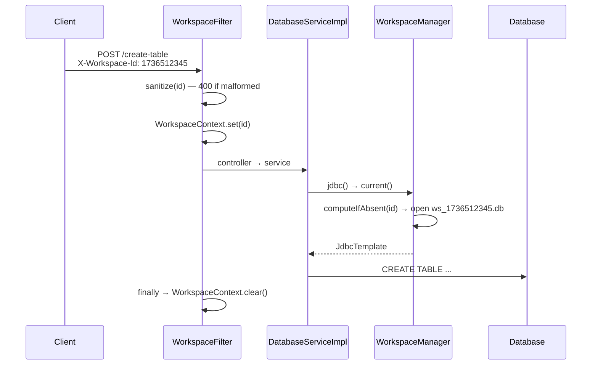

# SQL Visualizer — Backend

Spring Boot 3.3 / Java 17 REST API for importing, reflecting, editing and exporting relational
data. It is a complete port of the original Go (Gin) `db-viewer` backend; several class comments
still map Spring components back to their Go counterparts.

> **Repo-level docs:** [root README](../README.md) ·
> [System design](../docs/SYSTEM-DESIGN.md) · [Database design](../docs/DATABASE-DESIGN.md)

---

## Contents

- [The design in one paragraph](#the-design-in-one-paragraph)
- [Tech stack](#tech-stack)
- [Project structure](#project-structure)
- [Workspace isolation](#workspace-isolation)
- [API endpoints](#api-endpoints)
- [Request/response shapes](#requestresponse-shapes)
- [Running locally](#running-locally)
- [Configuration](#configuration)
- [MySQL mode](#mysql-mode)
- [Docker](#docker)
- [Testing](#testing)
- [Extending the API](#extending-the-api)
- [Go → Java conversion notes](#go--java-conversion-notes)

---

## The design in one paragraph

This service has **no schema of its own**. Every table it touches is defined at runtime by the user
or by an uploaded file, so there is no JPA entity layer, no migrations, and no ORM — just
`JdbcTemplate` plus database metadata queries (`sqlite_master`, `PRAGMA table_info`,
`PRAGMA foreign_key_list`, or `SHOW TABLES` / `DESCRIBE` / `INFORMATION_SCHEMA` on MySQL). Each SQL
file open in the UI is a **workspace** with its own physical database, selected per request by the
`X-Workspace-Id` header. Controllers stay thin; all SQL generation, CSV parsing, type inference and
export formatting live in `DatabaseServiceImpl`.

---

## Tech stack

| Layer | Technology |
|---|---|
| Language | Java 17 |
| Framework | Spring Boot 3.3.0 |
| Web | Spring Web MVC |
| Data access | Spring JDBC (`JdbcTemplate`) — no ORM |
| Database | SQLite 3.45 (default) / MySQL 8 (`mysql` profile) |
| Connection handling | `SingleConnectionDataSource` per SQLite workspace, HikariCP per MySQL workspace |
| API docs | springdoc-openapi 2.5 (Swagger UI) |
| Boilerplate | Lombok (`@Data`, `@Builder`, `@RequiredArgsConstructor`, `@Slf4j`) |
| Build | Maven 3.9 (wrapper included — no local Maven needed) |
| Tests | JUnit 5, Spring Boot Test, MockMvc, AssertJ |
| Container | Docker (multi-stage, Alpine JRE) |

---

## Project structure

```
db-viewer-backend/
├── Dockerfile                  Multi-stage build → Alpine JRE
├── docker-compose.yml          SQLite service + optional MySQL profile
├── mvnw / mvnw.cmd             Maven wrapper
├── pom.xml
└── src/
    ├── main/
    │   ├── java/com/dbviewer/app/
    │   │   ├── DbViewerApplication.java        Entry point (mirrors main.go)
    │   │   ├── common/
    │   │   │   └── Constants.java              Every SQL statement the app issues
    │   │   ├── exception/                      Every custom exception lives here
    │   │   │   ├── EmailAlreadyRegisteredException.java   → 409
    │   │   │   ├── TableInUseException.java               → 409, names the blocking tables
    │   │   │   └── UnauthorizedException.java             → 401
    │   │   ├── auth/
    │   │   │   ├── AuthContext.java            ThreadLocal identity for the request
    │   │   │   └── AuthFilter.java             Binds the Bearer token; never rejects
    │   │   ├── template/
    │   │   │   └── TemplateSchemaParser.java   CREATE TABLE parser for the preview diagram
    │   │   ├── config/
    │   │   │   ├── CorsConfig.java             Permissive CORS (no credentials)
    │   │   │   ├── DatabaseConfig.java         Bootstraps the default DB's `users` table
    │   │   │   └── OpenApiConfig.java          Swagger metadata
    │   │   ├── controller/                     Every REST endpoint lives here
    │   │   │   ├── DatabaseController.java     All data routes; thin, try/catch → {error}
    │   │   │   ├── AuthController.java         /auth/signup, /auth/login, /auth/me
    │   │   │   ├── ShareController.java        /share, /shares
    │   │   │   ├── TemplateController.java     /templates
    │   │   │   └── GlobalExceptionHandler.java
    │   │   ├── dto/                            One POJO per request/response shape
    │   │   ├── service/                        Contracts — one interface per service
    │   │   │   ├── DatabaseService.java        Schema, data, import/export
    │   │   │   ├── AuthService.java            Signup, login, current user
    │   │   │   ├── JwtService.java             Issue and verify session tokens
    │   │   │   ├── ShareService.java           Read-only share links
    │   │   │   ├── TemplateService.java        Catalogue + the Template record shapes
    │   │   │   └── impl/                       The implementations
    │   │   │       ├── DatabaseServiceImpl.java    CSV parsing, exports, schema edits
    │   │   │       ├── AuthServiceImpl.java        BCrypt hashing, password policy
    │   │   │       ├── JwtServiceImpl.java         HMAC-SHA256 signing
    │   │   │       ├── ShareServiceImpl.java       Token minting and revocation
    │   │   │       └── TemplateServiceImpl.java    Loads manifest + .sql at startup
    │   │   ├── sql/
    │   │   │   ├── SqlScriptSplitter.java      Comment/quote/DELIMITER-aware statement splitter
    │   │   │   └── MySqlToSqliteTranslator.java  Dump translation + ALTER-key folding
    │   │   └── workspace/
    │   │       ├── WorkspaceContext.java       ThreadLocal holding the request's workspace id
    │   │       ├── WorkspaceFilter.java        Binds the id; rejects malformed ids with 400
    │   │       └── WorkspaceManager.java       One DataSource per workspace
    │   └── resources/
    │       ├── application.properties          SQLite defaults
    │       ├── application-mysql.properties    MySQL profile
    │       └── application-prod.properties     Production overrides
    └── test/
        ├── java/com/dbviewer/app/
        │   ├── auth/AuthAndSharingTest.java                        14 auth + sharing tests
        │   ├── controller/DatabaseControllerIntegrationTest.java   19 MockMvc tests
        │   ├── service/ColumnEditTest.java                         12 column-edit tests
        │   ├── service/TableLifecycleTest.java                      9 delete/notes tests
        │   ├── sql/SqlImportTest.java                               8 SQL-import tests
        │   ├── template/TemplateCatalogueTest.java                  9 template tests
        │   └── workspace/WorkspaceIsolationTest.java                8 isolation tests
        └── resources/
            ├── application-test.properties     In-memory SQLite
            └── test-files-for-upload/sample.csv
```

---

## Workspace isolation

Every SQL file open in the UI maps to an independent database, so two files can define the same
table names without colliding.



| Aspect | Behaviour |
|---|---|
| Where the id comes from | `X-Workspace-Id` header, or a `workspaceId` query param (needed for the two download endpoints, since a browser download cannot set headers) |
| Validation | `^[A-Za-z0-9_-]{1,64}$`, enforced in `WorkspaceFilter` — malformed ids get a `400 {"error": ...}` and never reach a controller |
| SQLite layout | One file per workspace: `${app.workspace.dir}/ws_<id>.db` |
| MySQL layout | One schema per workspace: `ws_<id>`, created on demand (the configured user needs `CREATE`/`DROP DATABASE`) |
| Creation | Lazy — the first request for an id creates the DataSource and the database |
| No header? | Falls back to the default datasource from `application.properties`. Swagger, `curl` and the whole test suite work exactly as before |
| Cleanup | `DELETE /workspace` closes the pool and deletes the file / drops the schema; `@PreDestroy` closes everything on shutdown |
| Listing | `GET /workspaces` reports every workspace that still has a database — a directory scan on SQLite, `information_schema.SCHEMATA` on MySQL. The UI reconciles its remembered file list against this after a browser refresh, so a workspace whose database is gone is dropped rather than lazily recreated as an empty one |
| Concurrency | One retained connection per SQLite workspace (SQLite serialises internally, avoiding `SQLITE_BUSY`); a 5-connection Hikari pool per MySQL workspace |

**Adding a new endpoint requires no workspace awareness.** `DatabaseServiceImpl.jdbc()` resolves the
current workspace on every statement, so as long as new code uses `jdbc()` rather than injecting a
`JdbcTemplate` directly, it is scoped automatically.

---

## API endpoints

| Method | Path | Go handler | Description | Scope |
|---|---|---|---|---|
| `GET` | `/` | inline | Health check, plus the app version | — |
| `GET` | `/version` | *(new)* | Version declared in `pom.xml`, bumped on every merge to `master` | — |
| `POST` | `/import/analyze` | — | Dry run: what importing the file would create. Creates nothing | header |
| `POST` | `/upload` | `HandleFileUpload` | Import `.csv` or `.sql` (multipart, field `file`; optional `columnTypes` JSON) | header |
| `POST` | `/query` | `HandleQuery` | Execute raw SQL | header |
| `GET` | `/db-info` | `HandleGetDBInfo` | All schemas, row previews (≤100) and relationships | header |
| `GET` | `/table-data/{table}` | `HandleGetTableData` | Columns + rows (≤100) for one table | header |
| `POST` | `/create-table` | `HandleCreateTable` | Create a table with PK / `NOT NULL` / FKs | header |
| `POST` | `/alter-table` | `HandleAddColumn` | Add a column | header |
| `POST` | `/update-column` | *(new)* | Rename a column, or change its type or nullability | header |
| `DELETE` | `/table/{name}` | *(new)* | Drop a table; 409 when still referenced by a foreign key | header |
| `GET` | `/templates` | *(new)* | The starter-schema catalogue; public | — |
| `GET` | `/templates/{id}` | *(new)* | One template including its SQL | — |
| `POST` | `/templates/{id}/apply` | *(new)* | Create a template's tables in the workspace | header |
| `POST` | `/demo` | *(new)* | Shortcut for applying the Online Store template | header |
| `GET` `POST` `DELETE` | `/table-notes...` | *(new)* | Per-table to-do notes | header |
| `POST` | `/auth/signup` · `/auth/login` | *(new)* | Create an account / sign in | — |
| `GET` | `/auth/me` | *(new)* | Current user, `{}` when anonymous | — |
| `POST` | `/share` | *(new)* | Create a share link **(account required)** | header |
| `GET` | `/share/{token}` | *(new)* | View a shared schema (public) | — |
| `POST` | `/insert-row` | `HandleInsertRow` | Insert a row (empty or with values) | header |
| `POST` | `/update-cell` | `HandleUpdateCell` | Update one cell by row `id` | header |
| `POST` | `/delete-row` | `HandleDeleteRow` | Delete a row by `id` | header |
| `DELETE` | `/clear` | `HandleClearDatabase` | Drop every table (workspace survives) | header |
| `GET` | `/workspaces` | *(new)* | Ids of workspaces that still have a database | — |
| `DELETE` | `/workspace` | *(new)* | Delete the workspace's database outright | header |
| `GET` | `/export/{table}` | `HandleExportCSV` | Download the table as CSV | **query param** |
| `GET` | `/export-sql` | `HandleExportDatabaseSQL` | Download a full SQL script, rebuilt for `?dialect=` | **query param** |
| `GET` | `/dialects` | — | The engines an export can target | — |
| `GET` | `/swagger-ui.html` | — | Interactive API docs | — |

Errors are uniform: a non-2xx status with a `{"error": "<message>"}` body.

---

## Request/response shapes

<details>
<summary><code>POST /create-table</code></summary>

```jsonc
{
  "tableName": "order_items",
  "columns": [
    { "name": "id",       "type": "INT",     "isPk": true },
    { "name": "order_id", "type": "INT",     "refTable": "orders", "refCol": "id" },
    { "name": "sku",      "type": "VARCHAR", "length": 128, "notNull": true }
  ]
}
```

Produces:

```sql
CREATE TABLE "order_items" (
    "id"       INTEGER PRIMARY KEY AUTOINCREMENT,
    "order_id" INTEGER DEFAULT 0,
    "sku"      VARCHAR(128) NOT NULL,
    FOREIGN KEY ("order_id") REFERENCES "orders"("id") ON DELETE CASCADE
);
```

> `isPk` is the wire name; the DTO field is `pk`, annotated `@JsonProperty("isPk")` with aliases
> `pk` / `is_pk`. This is load-bearing — see the note in
> [DATABASE-DESIGN.md §4.3](../docs/DATABASE-DESIGN.md#43-primary-keys).
</details>

<details>
<summary><code>POST /update-column</code></summary>

```jsonc
// Every field except tableName/columnName is optional; omitting one leaves it unchanged.
{ "tableName": "books", "columnName": "pages", "newColumnName": "page_count",
  "columnType": "INT", "length": 0, "notNull": true }
```

A pure rename is a single `ALTER TABLE ... RENAME COLUMN`. A type or nullability change is
`CHANGE COLUMN` on MySQL, but SQLite cannot alter a column in place, so the table is rebuilt
from its own metadata - preserving the primary key, auto-increment, defaults, foreign keys and
rows. Rows holding NULL in a column that becomes `NOT NULL` are backfilled with the type
default. A primary key may be renamed but not retyped.
</details>

<details>
<summary><code>POST /alter-table</code></summary>

```jsonc
{ "tableName": "customers", "columnName": "email", "columnType": "VARCHAR", "length": 256, "notNull": true }
```

`notNull` adds a type-appropriate `DEFAULT` so existing rows stay valid
(`''` for text, `0` for numbers, `'1970-01-01'` for dates).
</details>

<details>
<summary><code>GET /db-info</code></summary>

```jsonc
{
  "tables": [
    { "name": "orders",
      "columns": [ { "name": "id", "type": "INTEGER" },
                   { "name": "customer_id", "type": "INTEGER" } ],
      "rows": [ /* up to 100 */ ] }
  ],
  "relationships": [
    { "sourceTable": "orders", "sourceColumn": "customer_id",
      "targetTable": "customers", "targetColumn": "id" }
  ]
}
```
</details>

<details>
<summary>Row operations</summary>

```jsonc
// POST /insert-row  — "id" and empty strings are stripped so defaults apply
{ "tableName": "customers", "data": { "name": "alice", "email": "a@x.com" } }

// POST /update-cell
{ "tableName": "customers", "recordId": "1", "columnName": "email", "newValue": "b@x.com" }

// POST /delete-row
{ "tableName": "customers", "recordId": "1" }
```

All three address rows by an `id` column — a table without one can be read but not row-edited.
</details>

---

## Running locally

Requirements: Java 17+ (`java -version`).

```bash
# Run with the Maven wrapper
./mvnw spring-boot:run                # Windows: mvnw.cmd spring-boot:run

# Or build a JAR first
./mvnw clean package -DskipTests
java -jar target/db-viewer-*.jar

# On a different port
./mvnw spring-boot:run -Dspring-boot.run.arguments=--server.port=8090
```

- App: <http://localhost:8080>
- Swagger UI: <http://localhost:8080/swagger-ui.html>
- OpenAPI JSON: <http://localhost:8080/v3/api-docs>

Smoke test:

```bash
curl localhost:8080/                                    # {"status":"Service is up and running"}
curl localhost:8080/db-info -H 'X-Workspace-Id: demo'   # {"tables":[],"relationships":[]}
```

---

## Configuration

| Variable | Default | Purpose |
|---|---|---|
| `PORT` | `8080` | HTTP port |
| `DB_PATH` | `./visualizer.db` | SQLite file for the **default** (no-workspace) database |
| `WORKSPACE_DIR` | `./data/workspaces` | Directory holding one `.db` per workspace |
| `AUTH_SECRET` | *(none)* | Signing key for session tokens; 32+ chars. Blank means a random key per restart |
| `SPRING_PROFILES_ACTIVE` | *(none)* | `mysql` and/or `prod` |
| `MYSQL_HOST` / `MYSQL_PORT` | `localhost` / `3306` | MySQL profile only |
| `MYSQL_DB` | `dbviewer` | Default schema for no-workspace requests |
| `MYSQL_USER` / `MYSQL_PASSWORD` | `root` / `root` | MySQL credentials |

Property keys of note in `application.properties`:

```properties
spring.datasource.url=jdbc:sqlite:${DB_PATH:./visualizer.db}
app.db.driver=sqlite                                # sqlite | mysql — selects SQL dialect
app.workspace.dir=${WORKSPACE_DIR:./data/workspaces}
spring.servlet.multipart.max-file-size=50MB         # upload cap
```

`app.db.driver` is what `isSqlite()` / `isMysql()` branch on. Switching to MySQL means activating
the `mysql` profile, which sets both the datasource **and** this key.

---

## MySQL mode

```bash
docker-compose --profile mysql up     # MySQL 8 + a second API instance on :8081
```

Or against an existing server:

```bash
java -jar target/db-viewer-*.jar \
  --spring.profiles.active=mysql \
  --MYSQL_HOST=localhost --MYSQL_USER=user --MYSQL_PASSWORD=secret
```

Differences from SQLite mode:

- Identifiers are quoted with `` ` `` instead of `"`.
- Primary keys emit `INT AUTO_INCREMENT PRIMARY KEY` instead of `INTEGER PRIMARY KEY AUTOINCREMENT`.
- `TEXT` from CSV inference becomes `VARCHAR(255)`.
- Uploaded `.sql` scripts are **not** normalised (the SQLite cleanup pass is skipped).
- Each workspace is a schema, so the user needs `CREATE`/`DROP DATABASE` privileges.

---

## Docker

```bash
# Build and run (SQLite, data persisted in a volume)
docker build -t db-viewer .
docker run -p 8080:8080 -v "$(pwd)/data:/data" db-viewer

# Docker Compose (SQLite)
docker-compose up app

# Docker Compose (MySQL)
docker-compose --profile mysql up
```

The image sets `DB_PATH=/data/visualizer.db` and `WORKSPACE_DIR=/data/workspaces`, so mounting
`/data` persists both the default database and every workspace.

---

## Testing

```bash
./mvnw test                                     # all 81 tests
./mvnw test -Dtest=WorkspaceIsolationTest       # one class
./mvnw test -Dtest=ColumnEditTest#renameColumn_shouldKeepTypeAndData
```

Everything runs against in-memory SQLite (`jdbc:sqlite::memory:`) — no external database, no
fixtures to load.

| Class | Count | Covers |
|---|---|---|
| `DatabaseControllerIntegrationTest` | 18 | Every route via MockMvc: routing, binding, error status codes, workspace scoping, generated DDL, and the effect of each call |
| `WorkspaceIsolationTest` | 8 | Same table name in two workspaces, row leakage, default-DB separation, workspace deletion, id sanitisation, MySQL URL rewriting |
| `ColumnEditTest` | 12 | Rename/retype/renullify a column, SQLite rebuild preserving keys/FKs/data, primary-key protection, identifier validation, pragma restoration |
| `SqlImportTest` | 8 | Real phpMyAdmin dump, comment-prefixed statements, semicolons in string literals, `DELIMITER` blocks, ALTER-key folding, skip reporting |
| `AuthAndSharingTest` | 14 | Signup validation, BCrypt hashing, no account enumeration, forged tokens, share create/view/revoke, anonymous refusal |
| `TableLifecycleTest` | 9 | Example schema, FK-guarded deletion, table notes |
| `TemplateCatalogueTest` | 11 | Every template applies, has relationships and rows, states accurate counts, and its parsed preview schema matches the real database |

Naming convention: `methodOrFeature_expectedBehavior`, e.g. `uploadCsv_shouldCreateTheTableAndItsRows`.

### What is deliberately not tested

The suite is kept to tests whose failure says something no other test would:

- **No separate service-level CRUD suite.** It asserted the same operations one layer below the
  controller tests, so every change had to be mirrored in two places while catching nothing extra.
  Going through MockMvc exercises the same service code *plus* the wiring around it.
- **No `contextLoads` test.** Every test class is `@SpringBootTest`; a broken context fails all of
  them first.
- **Assert effects, not status codes.** A test that only checks for `200` passes against a handler
  that silently does nothing — which is exactly how the dropped `isPk` flag went unnoticed.

The remaining tests were validated by mutation: reintroducing the `isPk` binding bug, the SQL
comment-stripping bug, and a workspace-routing bug each made the suite fail.

---

## Importing a `.sql` file

An uploaded script goes through two stages before anything is executed.

**1. `SqlScriptSplitter`** breaks the script into statements. It replaces a plain
`script.split(";")`, which failed on real dumps three different ways:

| Input | Old behaviour |
|---|---|
| `-- comment` banner before each statement | The chunk began with `--`, so the whole statement was skipped as a comment. In a phpMyAdmin dump that is *every* statement, so nothing imported at all. |
| `VALUES ('a;b')` | Split mid-statement on the semicolon inside the string literal. |
| `DELIMITER $$ ... $$` around a trigger | Shredded into fragments; the leftover `END $$ DELIMITER` was then executed and failed. |

The splitter is comment-, quote- and `DELIMITER`-aware, and strips comments so a returned
statement always begins with real SQL.

**2. `MySqlToSqliteTranslator`** (SQLite mode only) rewrites what remains. Beyond dropping
MySQL-only directives, its important job is **key folding**. phpMyAdmin declares keys after the
table exists:

```sql
CREATE TABLE `account` (`Acc_id` int(255) NOT NULL, ...) ENGINE=InnoDB;
ALTER TABLE `account` ADD PRIMARY KEY (`Acc_id`);
ALTER TABLE `account` MODIFY `Acc_id` int(255) NOT NULL AUTO_INCREMENT;
ALTER TABLE `account` ADD CONSTRAINT ... FOREIGN KEY (`Cust_id`) REFERENCES `customer` (`Cust_id`);
```

SQLite supports none of those ALTER forms, so executed as-is the import produces tables with no
primary keys and no relationships — a diagram of disconnected boxes. The translator collects them
and folds them into the `CREATE TABLE` instead, forcing an auto-increment key to
`INTEGER PRIMARY KEY AUTOINCREMENT` as SQLite requires.

The upload response reports what happened, so the UI can show it rather than burying it in a log:

```jsonc
{ "message": "SQL executed successfully", "type": "sql",
  "statementsExecuted": 12, "statementsSkipped": 0,
  "warningCount": 6,
  "warnings": ["Skipped MySQL-only statement: CREATE TRIGGER `Bill_date` ...", "..."] }
```

---

## Accounts and sharing

The app is usable signed out. An account is required for exactly two things — **exporting a file**
and **creating a share link** — because both take data out of the app.

| Concern | How |
|---|---|
| Passwords | BCrypt via `spring-security-crypto`. Only the hash is stored |
| Password policy | 8+ characters, at least one capital letter and one special character. Every unmet rule is reported at once, so the user does not discover them one rejected attempt at a time. Enforced on **signup only** — applying it at sign-in would lock out accounts created before the rule |
| Sessions | A JWT signed with `app.auth.secret`, valid 30 days, sent as `Authorization: Bearer` |
| Missing secret | A random key is generated at startup with a warning. Deliberately not a hardcoded default, which would let anyone mint valid tokens — the cost is that sessions do not survive a restart |
| Enforcement | `AuthContext.require()` inside the handler, **not** in the UI. `AuthFilter` never rejects a request; an absent or invalid token simply means anonymous |
| Login errors | "Email or password is incorrect." for both an unknown address and a wrong password, so the endpoint cannot be used to discover registered emails |
| Duplicate emails | Rejected with **409** and an `emailAlreadyRegistered` flag the UI turns into a "sign in instead" prompt. Checked *before* the password, because no password would make that signup succeed - reporting a password problem first would send the user off to fix the wrong thing. Addresses are lower-cased, so casing cannot create a second account, and the `UNIQUE` column plus a unique-violation catch cover two signups racing |
| Share tokens | 192 bits of `SecureRandom`, URL-safe. One link per file per owner, so re-sharing does not mint new tokens |
| Viewing a share | Public: the token *is* the credential. Read-only — the route only ever reads the schema |

> ⚠️ Accounts gate two actions; they are **not** an authorisation model. Any caller who knows a
> workspace id can still read and edit that workspace.

The application's own tables (`app_users`, `shared_links`) live in the **default** database, not in
a workspace — a user and their links exist across every file they open. Per-table notes are the
opposite: they live *inside* the workspace as `__table_notes`, so they travel with the file. Any
table whose name starts with `__` is filtered out of the schema listing, so it never reaches the
canvas or an export.

---

## Starter templates

The landing page's template catalogue is authored entirely here. A template is two files:

```
src/main/resources/templates/
├── manifest.json        id, name, description, category, tags, featured
├── ecommerce.sql        the schema plus a few sample rows
├── blog.sql
└── ...
```

Adding one is a **backend-only change** — drop in a `.sql` file, add a manifest entry, restart.
The frontend renders whatever `GET /templates` returns and needs no release.

| Aspect | How |
|---|---|
| Loading | Parsed once at startup. A template that fails to load is logged and skipped rather than taking the whole catalogue — and the app — down |
| Stats | `tableCount`, `tables[]` and `relationshipCount` are **derived from the SQL**, never repeated in the manifest, so a card cannot claim a shape the template does not have |
| Counting | Only within `CREATE TABLE` statements, after the splitter has stripped comments. Scanning the raw file counted the words "foreign key" appearing in a header comment *and* in sample data (a task titled "Draw foreign key edges"), overstating two templates. `TemplateCatalogueTest` now applies every template and asserts the stated counts against the real schema |
| Applying | Goes through `DatabaseServiceImpl.runScript`, the same path a `.sql` upload takes, so a template behaves like a file the user imported. Refused when the workspace already has tables |
| Preview schema | `TemplateSchemaParser` turns the `CREATE TABLE` statements into tables, columns and foreign keys, so the landing page can draw the diagram without parsing SQL or the backend creating a throwaway database per preview. It is a narrow parser for templates we author ourselves — kept honest by a test that applies every template and compares the parsed result against the live metadata |
| Payload | The list response omits `sql` and `schema`; they are the bulk of a template and the catalogue is fetched on first paint. Both endpoints send `Cache-Control: public, max-age=600`, since the catalogue only changes when a new build ships |
| Failures | Unlike an upload, a failing statement is fatal. These scripts ship with the app, so a failure is our bug, not the user's malformed input |

Every template must declare foreign keys: the canvas draws its edges from them, and a template
without any would render as a row of disconnected boxes. A test enforces this.

---

## Versioning

`.github/scripts/release-version.sh` increments the patch version in `pom.xml` on every merge to
`master` and tags the commit `vX.Y.Z`. It asks Maven for the current version rather than parsing
the POM, because `<version>` also appears for the parent and for pinned dependencies and only the
project's own may change. The bump runs *before* the jar is built, so `GET /version` on the
deployed API always reports the version that merge produced.

---

## Extending the API

1. **DTO** — add a POJO in `dto/` with Lombok `@Data @NoArgsConstructor @AllArgsConstructor`.
   For a `boolean` field, prefer a name **without** an `is` prefix; Lombok's accessors otherwise
   make Jackson derive a different property name than you expect (this exact trap silently broke
   primary keys — see `ColumnDefinition`).
2. **Contract** — declare the method on `DatabaseService` with a javadoc comment.
3. **Implementation** — implement it in `DatabaseServiceImpl` using `jdbc()`, never an injected
   `JdbcTemplate`, so it is workspace-scoped. Bind values as `?` parameters; quote identifiers with
   the driver-appropriate character (`isMysql() ? "`" : "\""`).
4. **Route** — add a thin method to `DatabaseController` with `@Operation` for Swagger, returning
   `{"error": ...}` on failure.
5. **Tests** — add both a service test and a MockMvc test.
6. **Frontend** — add the call to `db-viewer-ui/services/api.ts`; nothing else should call the API
   directly.

---

## Go → Java conversion notes

| Go | Java |
|---|---|
| `gin.Context` JSON response | `ResponseEntity<?>` |
| `database/sql` `DB.Exec` | `JdbcTemplate.execute` / `update` |
| `database/sql` `DB.Query` | `JdbcTemplate.queryForList` |
| `PRAGMA table_info` | Same SQL via `JdbcTemplate` |
| `csv.NewReader` | Custom `parseCsvLine` (quoted-field aware) |
| `gin-contrib/cors` | Spring `CorsFilter` |
| `swaggo/gin-swagger` | springdoc-openapi |
| `os.Getenv("DB_PATH")` | `${DB_PATH:./visualizer.db}` in properties |
| Multi-statement `DB.Exec` | Split on `;`, execute each statement |
| *(no equivalent)* | `WorkspaceManager` — per-file database isolation, added after the port |
