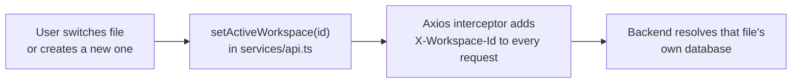

# SQL Visualizer — Frontend

Next.js 16 (App Router) single-page workspace for importing `.csv`/`.sql` files, visualizing their
schema as an interactive entity-relationship canvas, editing tables and rows, and exporting the
result.

> **Repo-level docs:** [root README](../README.md) ·
> [System design](../docs/SYSTEM-DESIGN.md) · [Database design](../docs/DATABASE-DESIGN.md) ·
> [Frontend gotchas & change workflow](CLAUDE.md)

---

## Contents

- [Getting started](#getting-started)
- [Scripts](#scripts)
- [Environment](#environment)
- [Project structure](#project-structure)
- [Architecture](#architecture)
  - [State ownership](#state-ownership)
  - [Workspaces](#workspaces)
  - [The API boundary](#the-api-boundary)
  - [Schema → canvas transform](#schema--canvas-transform)
- [Component guide](#component-guide)
- [Styling](#styling)
- [Gotchas](#gotchas)
- [Adding a feature](#adding-a-feature)

---

## Getting started

The backend must be running first — the UI does nothing useful without it.

```bash
# Terminal 1 — backend on :8080
cd ../db-viewer-backend
./mvnw spring-boot:run          # Windows: mvnw.cmd spring-boot:run

# Terminal 2 — frontend on :3000
npm install
npm run dev
```

Open <http://localhost:3000>, then either **Import** a `.csv`/`.sql` file or click **Create New
File** to start from an empty database.

---

## Scripts

| Command | What it does |
|---|---|
| `npm run dev` | Dev server on <http://localhost:3000> (Turbopack) |
| `npm run build` | Production build — `output: "standalone"` for Azure |
| `npm run start` | Serve the production build |
| `npm run lint` | ESLint (flat config in `eslint.config.mjs`) |
| `npx tsc --noEmit` | Type-only check |

There is **no test suite**. `npx tsc --noEmit`, `npm run lint` and `npm run build` are the gates —
run all three before pushing.

---

## Environment

| Variable | Default | Notes |
|---|---|---|
| `NEXT_PUBLIC_API_URL` | `http://localhost:8080` | Backend base URL, read in `services/api.ts` |

Files present: `.env.local` (local dev) and `.env.production` (the deployed Azure API).

⚠️ `NEXT_PUBLIC_*` values are **inlined at build time**. Changing the API URL requires restarting
`npm run dev` or rebuilding — a restart of the running server is not enough.

---

## Project structure

```
db-viewer-ui/
├── app/
│   ├── layout.tsx              Root layout; JetBrains Mono via next/font
│   ├── page.tsx                ★ Owns all application state
│   └── globals.css             Tailwind v4 entry + design tokens
├── components/
│   ├── header/Header.tsx           Import / refresh / export / clear / help
│   ├── editor/
│   │   ├── FileExplorer.tsx        Left tree: files → tables → columns; search; collapse
│   │   └── DataEditor.tsx          Row view / cell + whole-row edit / insert / delete modal
│   ├── canvas/Visualizer.tsx       React Flow canvas, toolbar, zoom control
│   ├── tables/TableNode.tsx        One table as a graph node (custom React Flow node)
│   └── modal/
│       ├── NewFileModal.tsx        Name a new empty SQL file
│       ├── CreateTableModal.tsx    Full table definition incl. PK / NOT NULL / FK
│       ├── AddColumnModal.tsx      Single-column ALTER TABLE (portalled)
│       ├── EditColumnModal.tsx     Rename / retype an existing column (portalled)
│       ├── NoticeModal.tsx         Error / warning / success with collapsible details
│       ├── NewTableHelpModal.tsx   Canvas toolbar: what the New Table button does
│       └── InfoModal.tsx           "What is this app" summary + version + credits
├── services/
│   ├── api.ts                  ★ The only module that talks to the backend
│   ├── sessionStorage.ts       Remembers open files + canvas layout across a refresh
│   └── exportImage.ts          Canvas → PNG via html-to-image
├── types/index.ts              Shared response types
├── hooks/useSchema.ts          Legacy hook — NOT on the active code path
├── tailwind.config.js          Vestigial (Tailwind v4 is configured from CSS)
└── next.config.ts              output: "standalone"
```

---

## Architecture

### State ownership

`app/page.tsx` is deliberately the single owner of application state. Everything else is
presentational or calls `dbService` and then asks the page to refresh.

```ts
interface Workspace {
    id: string;             // also the backend workspace id
    name: string;           // filename shown in the explorer and used for export
    nodes: Node[];          // React Flow nodes — positions survive refreshes
    edges: Edge[];          // derived from backend relationships
    fileData: ExplorerFile; // tree projection for the file explorer
    isImported: boolean;    // uploaded vs. created empty (affects the export filename)
}
```

The server is the source of truth. After **any** mutation the page calls `refreshActiveSchema()`,
which re-fetches `GET /db-info` and rebuilds nodes and edges. The one genuinely client-side piece of
state is **node position**: `refreshActiveSchema` preserves the existing position of any node whose
table still exists, so a refresh never scatters a layout you arranged.

⚠️ **`refreshActiveSchema` must stay `useCallback(..., [])`.** Every table node stores it in its
React Flow `data.onRefresh`, captured when the node was built. It reads the active file from
`activeWorkspaceIdRef`, not from the `activeWorkspaceId` state, because a file is created and its
nodes are built in the same tick as `setActiveWorkspaceId` — a closure over the state value is
still the *previous* id (`null` for the first file), so refreshing from a node returned early and
the canvas silently never updated even though the backend change had gone through. Adding a
dependency to that `useCallback` reintroduces the bug.

### Workspaces

Each open file is an independent backend database. The file's `id` **is** the backend workspace id.



Two places set it:

- A `useEffect` in `page.tsx` on `activeWorkspaceId` change — the normal path.
- **Synchronously**, before the API call, in `handleFileUpload` and `handleCreateBlankFile`. This
  matters: a new file's id is generated and used in the same tick, before React re-renders, so
  waiting for the effect would send the upload to whichever file was previously open.

If an upload fails, the page rebinds the client to the previously active workspace so a failed
import doesn't strand later calls against a database that was never populated.

Closing a file calls `DELETE /workspace`, which deletes that file's database and leaves every other
open file untouched.

### The API boundary

`services/api.ts` is the only module that talks to the backend. It owns the Axios instance, the
active workspace id, cache-busting, and the two download URL builders.

```ts
let activeWorkspaceId: string | null = null;

export const setActiveWorkspace = (workspaceId: string | null) => {
    activeWorkspaceId = workspaceId;
};

api.interceptors.request.use((config) => {
    if (activeWorkspaceId) config.headers.set('X-Workspace-Id', activeWorkspaceId);
    return config;
});
```

Downloads are the exception: `window.open()` and `<a download>` cannot attach custom headers, so
`getDownloadUrl` and `getDatabaseExportUrl` append `&workspaceId=` instead. Keep that in mind if you
add another download endpoint.

Schema and table reads append a `_t`/`t` timestamp so the browser can never serve a stale schema.

| `dbService` method | Endpoint |
|---|---|
| `uploadFile(file)` | `POST /upload` |
| `getVersion()` | `GET /version` |
| `listWorkspaces()` | `GET /workspaces` |
| `getSchema()` | `GET /db-info` |
| `getTableData(table)` | `GET /table-data/{table}` |
| `createTable(name, cols)` | `POST /create-table` |
| `addColumn(params)` | `POST /alter-table` |
| `updateColumn(params)` | `POST /update-column` |
| `insertRow(table, data)` | `POST /insert-row` |
| `updateCell(params)` | `POST /update-cell` |
| `deleteRow(table, id)` | `POST /delete-row` |
| `clearDatabase()` | `DELETE /clear` |
| `deleteWorkspace()` | `DELETE /workspace` |
| `getDownloadUrl(table)` | `GET /export/{table}` (URL only) |
| `getDatabaseExportUrl(name)` | `GET /export-sql` (URL only) |

### Session persistence

The open files survive a browser refresh. What is stored locally is deliberately minimal:

```ts
// localStorage key: sql-visualizer.session
{ version: 1, activeWorkspaceId: "1736512345",
  workspaces: [{ id, name, isImported, positions: { customers: {x, y} } }] }
```

Only ids, filenames and node positions — **never the schema**. On mount `page.tsx`:

1. reads the stored session,
2. calls `GET /workspaces` and keeps only entries whose database still exists,
3. re-fetches each one's schema with `GET /db-info` and rebuilds nodes and edges,
4. reapplies the saved positions per table name.

The databases stay the source of truth, so a cached schema can never go stale, and a wiped data
directory or a different backend leaves no ghost files in the explorer. If the backend is
unreachable the stored session is *kept*, not cleared — the file list should not be destroyed
because the server happened to be down.

Saving is debounced by 300 ms because dragging a node fires `onNodesChange` continuously. Every
`localStorage` access is wrapped in try/catch: it throws outright in Safari private browsing and
when storage is disabled by policy, and losing the session is not a reason to take the app down.

### Exporting

The header's **Export** menu offers two things, which are for different jobs:

| Option | Built by | Good for |
|---|---|---|
| **SQL script** | `GET /export-sql` (browser download) | Re-importing, running elsewhere, diffing |
| **Diagram image (PNG)** | `services/exportImage.ts` | *Reading the schema offline* — no tools needed, drops into a doc or a chat |

The PNG is sized to the diagram's own bounding box (`getRectOfNodes` + `getTransformForBounds`)
rather than the visible pane, so the whole schema is captured regardless of the current scroll or
zoom. React Flow renders every node into the DOM (virtualisation is off), so nothing off-screen is
missing. `pixelRatio: 2` keeps the 9px column labels legible.

### Schema → canvas transform

`transformSchemaToWorkspace()` in `page.tsx` converts the backend payload into React Flow data:

- **Nodes** — one `tableNode` per table, laid out on a 3-column grid, carrying `label`, `columns`,
  and the `onRefresh` / `onEdit` callbacks.
- **Edges** — one per declared foreign key, drawn `target → source` (parent → child) with handle ids
  of the form `${column}-right` / `${column}-left`.

The transform tolerates both `snake_case` and `camelCase` on relationship fields
(`target_table ?? targetTable`), because the payload shape has changed across backend ports.

---

## Component guide

| Component | Responsibility | Notes |
|---|---|---|
| `Header` | Import, refresh, export menu, clear, help | The SQL option builds a URL and clicks a synthetic `<a>` (imported files get a `modified_` prefix); the PNG option calls back into `page.tsx`, which owns the nodes. The menu closes on outside-click and Escape |
| `FileExplorer` | Files → tables → columns tree, search, collapse rail | Collapsed mode shows one icon per open file |
| `Visualizer` | React Flow canvas, **New Table** button, zoom select | Renders `CreateTableModal` and `NewTableHelpModal` as *siblings* of the canvas wrapper — see [Gotchas](#gotchas) |
| `TableNode` | One table: header actions, column list, FK handles, per-column edit button | Handles are inferred from naming convention (`id`, `*_id`), not real metadata |
| `DataEditor` | Row grid with per-cell and whole-row editing, insert form, delete | Assumes every row has an `id`/`ID`; input types derived from the SQL type |
| `CreateTableModal` | Full table definition: type, length, PK, NOT NULL, FK | Validates required names and duplicate column names before submitting |
| `AddColumnModal` | Single `ALTER TABLE ... ADD COLUMN` | Portalled to `document.body`; validates identifier shape and duplicate names |
| `EditColumnModal` | Rename a column, change its type or nullability | Portalled; pre-filled from backend metadata, sends only changed fields, locks type/nullability on a primary key |
| `NewFileModal` | Name a new empty file | Appends `.sql` if omitted |
| `InfoModal` | Five-line description of the app, the version badge, and developer credits | Opened from the **header's** help button. Version comes from `GET /version`, i.e. the backend's `pom.xml` |
| `NewTableHelpModal` | What the **New Table** button does, step by step | Opened from the info button in the **canvas toolbar**. Deliberately distinct from `InfoModal`: help for a control lives next to that control |
| `NoticeModal` | Any error/warning the user must see | Used for import reports — a `.sql` dump is rarely fully portable, so skipped statements are listed here instead of only in the server log |

---

## Styling

- **Tailwind CSS v4**, configured from CSS (`app/globals.css`) rather than JS content-globbing.
  `tailwind.config.js` still lists `./src/**` paths that don't exist here — it is vestigial
  scaffolding, not the active config.
- **Light theme only.** Fixed blue header, white body, blue accent. The dark/system toggle was
  removed because it only ever restyled the canvas and table nodes, never the rest of the chrome.
- **Font**: JetBrains Mono is loaded in `app/layout.tsx` and wired into Tailwind's `--font-mono`
  variable, so every `font-mono` class picks it up. Don't hardcode a font family per component.
- **Z-index ladder**: canvas panels < `DataEditor` (50) < page-level modals (100) <
  in-canvas modals (110) < `AddColumnModal` (120).

---

## Gotchas

**1. Fixed-position modals and transformed ancestors.** React Flow transforms its viewport, and the
canvas wrapper carries `animate-fade-up` (also a transform). A transformed ancestor becomes the
containing block for `position: fixed` descendants, so a modal nested inside the canvas silently
positions itself against the canvas pane instead of the viewport. Two mitigations are in use:

- `CreateTableModal` and `NewTableHelpModal` are rendered as **siblings** of the canvas wrapper,
  inside a `<>...</>` fragment. (`InfoModal` and `NoticeModal` live in `page.tsx`, outside the
  canvas entirely, so they are unaffected.)
- `AddColumnModal` opens from inside a `TableNode` — unavoidably deep inside the transformed
  viewport — so it renders through `createPortal(..., document.body)` and guards on a `mounted`
  flag because `document` doesn't exist during SSR.

Any new fixed modal must do one of these two things.

**2. `hooks/useSchema.ts` is not live code.** `page.tsx` duplicates its logic. Changing the hook
changes nothing at runtime.

**3. Canvas edge creation doesn't persist.** `onConnect` / `onEdgesChange` in `page.tsx` are
no-ops. Dragging a connection on the canvas is purely visual; foreign keys are only created through
`CreateTableModal`.

**4. Connection handles are placed by naming convention, not metadata.** `TableNode` treats a
column literally named `id` or ending in `_id` as a key and gives it a connection handle. Real
key metadata *is* available now — `ColumnInfo` carries `isPk` and `notNull`, which `EditColumnModal`
uses to pre-fill and `FileExplorer` uses to highlight primary keys — but the handle heuristic was
deliberately left as-is, so a column can show a handle without being a key.

**5. Row operations need an `id` column.** `DataEditor`'s update and delete paths address rows by
`id`/`ID`. A table without one can be viewed but not row-edited.

---

## Adding a feature

1. Start from **`app/page.tsx`** for anything workspace-level.
2. Add or change backend calls **only** in `services/api.ts`, and confirm the endpoint exists in
   `../db-viewer-backend/src/main/java/com/dbviewer/controller/DatabaseController.java`.
3. If a new endpoint needs workspace scoping, it gets it for free through the Axios interceptor —
   unless it's a browser download, which needs `&workspaceId=` on the URL.
4. Update `types/index.ts` when relying on new backend response fields.
5. New fixed-position modal? Re-read [Gotchas](#gotchas) §1 first.
6. Run `npx tsc --noEmit`, `npm run lint`, and `npm run build`.
