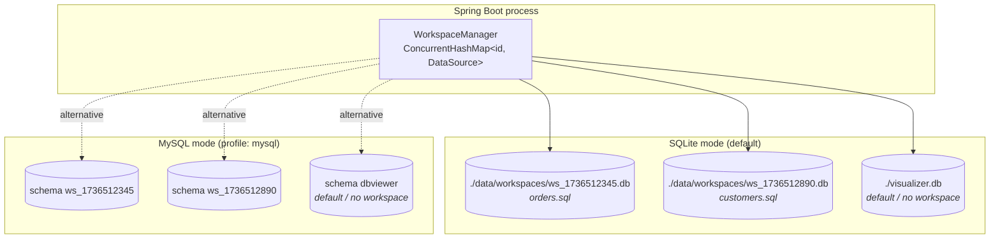
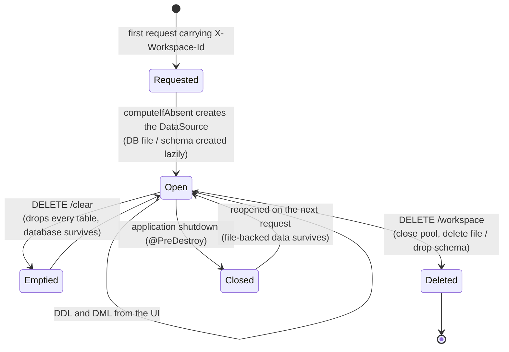
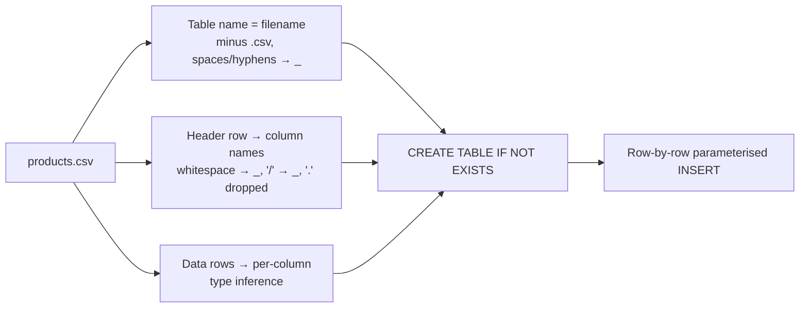
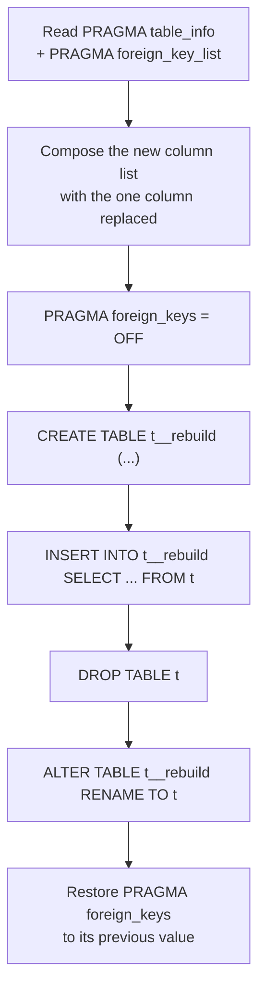
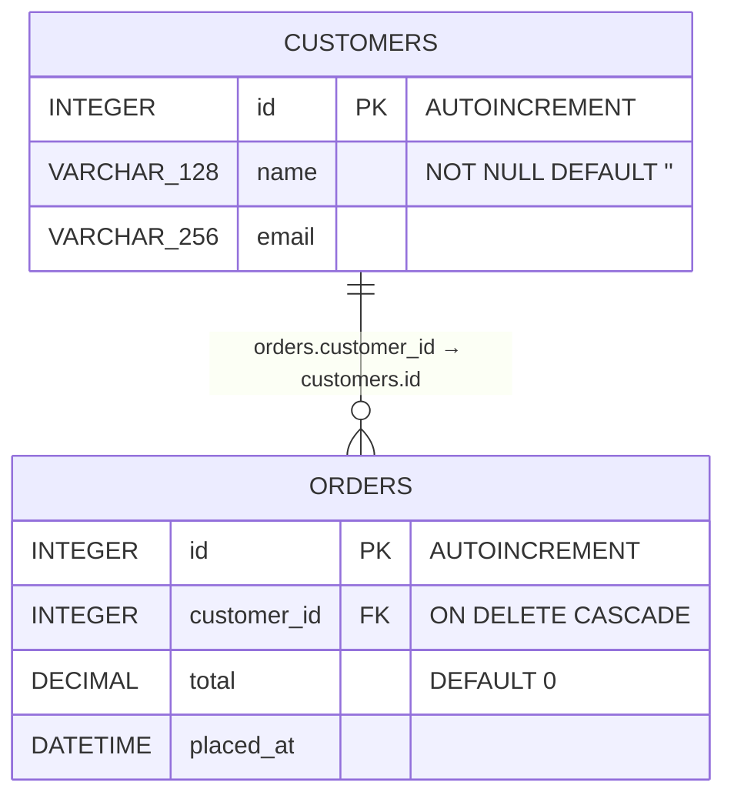

# Database Design — SQL Visualizer

> Companion document: [SYSTEM-DESIGN.md](./SYSTEM-DESIGN.md) covers the runtime architecture,
> request flows, and deployment. This document covers the storage layer: how databases are laid
> out, how schemas are created and reflected, how types are mapped, and what the constraints are.

---

## 1. The unusual thing about this database design

Most applications have a **fixed** schema that the code knows at compile time. This one does not.
SQL Visualizer has **no application schema at all** — no entities, no migrations, no ORM mappings.
Every table it touches is defined at runtime by the user (or by the `.csv`/`.sql` file they upload).

That inverts the usual design question. Instead of *"what tables does the app need?"* the questions
are:

1. **Where does each user's data live**, so two files can't tread on each other? → §2
2. **How is an unknown schema discovered** at request time? → §5
3. **What SQL does the app generate** for the operations it offers? → §6, §7
4. **How are types mapped** between the UI, SQLite, and MySQL? → §4

The only schema the application owns is a single legacy convenience table (§3.3).

---

## 2. Storage topology: one database per open file

Each SQL file open in the UI is a **workspace**, and each workspace is a **physically separate
database**. This is what lets two files each define a `users` table without colliding.



### 2.1 Isolation unit by driver

| Driver | Isolation unit | Location | Created by |
|---|---|---|---|
| SQLite (file) | One `.db` file | `${app.workspace.dir}/ws_<id>.db` (default `./data/workspaces`) | The SQLite driver, on first connection |
| SQLite (in-memory, tests) | One named shared-cache database | `jdbc:sqlite:file:ws_<id>?mode=memory&cache=shared` | Held alive by a retained connection |
| MySQL | One schema | `ws_<id>` on the configured server | `CREATE DATABASE IF NOT EXISTS` on first use |

### 2.2 Lifecycle of a workspace database



Two distinct destructive operations exist on purpose:

- **`DELETE /clear`** empties a workspace but keeps it — "start this file over".
- **`DELETE /workspace`** removes the database entirely — "close this file". This is what the UI
  calls when a file is closed, so a closed file's tables cannot resurface in a later session.

### 2.3 Workspace id rules

Ids originate in the browser (`Date.now().toString()`) and become both a **filesystem path
component** and a **SQL identifier**. They are therefore whitelisted, not escaped:

```
^[A-Za-z0-9_-]{1,64}$
```

Anything else — `../../etc/passwd`, a backtick, an empty string — is rejected with a 400. This is
the single validation that matters most in the storage layer, because it is the only user-supplied
value that reaches a `Path` and a `CREATE DATABASE` statement.

---

## 3. What lives inside a workspace database

### 3.1 User tables

Everything the user imports or creates. Names, columns, and constraints are entirely user-defined.
The application discovers them at request time (§5) and never caches them.

### 3.2 Driver-managed tables

SQLite creates `sqlite_sequence` when a table uses `AUTOINCREMENT`. It is filtered out of all
schema listings by the `name NOT LIKE 'sqlite_%'` predicate.

### 3.3 The `users` bootstrap table

`DatabaseConfig.init()` runs one statement at startup, against the **default** datasource only:

```sql
CREATE TABLE IF NOT EXISTS users (
    id   INTEGER PRIMARY KEY AUTOINCREMENT,
    name TEXT
);
```

This is a carry-over from the original Go backend. It exists so that a bare `GET /db-info` with no
workspace returns something rather than an empty canvas. **Workspace databases do not get it** — a
new SQL file starts genuinely empty, which is the correct behaviour for a file the user just named.

---

## 4. Type system

The UI offers a small, deliberately portable set of types. The backend maps them per driver.

### 4.1 UI type → physical type

| UI type | SQLite | MySQL | Notes |
|---|---|---|---|
| `VARCHAR` | `VARCHAR(n)` | `VARCHAR(n)` | `n` ∈ {64, 128, 256}; defaults to 128 when unset |
| `INT` | `INTEGER` | `INT` | `INTEGER` is required on SQLite for rowid aliasing / `AUTOINCREMENT` |
| `DECIMAL` | `DECIMAL` | `DECIMAL` | SQLite applies NUMERIC affinity |
| `BOOLEAN` | `BOOLEAN` | `BOOLEAN` | Stored as 0/1 |
| `DATE` | `DATE` | `DATE` | SQLite has no date type; stored as text with DATE affinity |
| `TIME` | `TIME` | `TIME` | As above |
| `DATETIME` | `DATETIME` | `DATETIME` | As above |
| `TEXT` | `TEXT` | `VARCHAR(255)` | MySQL substitution applies on CSV import |

SQLite's **type affinity** model means a declared type is a hint, not an enforced constraint: a
`VARCHAR(64)` column will happily store 200 characters. Declared types are still recorded faithfully
so that the diagram, the export, and a later MySQL migration all carry the author's intent.

### 4.2 Defaults added with `NOT NULL`

Adding a `NOT NULL` column to a table that already has rows fails unless a default is supplied, so
`resolveTypeDef` attaches a type-appropriate one:

| Base type | Emitted |
|---|---|
| `VARCHAR`, `TEXT` | `NOT NULL DEFAULT ''` |
| `INT`, `INTEGER`, `DECIMAL` | `NOT NULL DEFAULT 0` |
| `BOOLEAN` | `NOT NULL DEFAULT 0` |
| anything containing `DATE`/`TIME` | `NOT NULL DEFAULT '1970-01-01'` |
| other | `NOT NULL` (no default) |

### 4.3 Primary keys

| Driver | Emitted for a PK column |
|---|---|
| SQLite | `INTEGER PRIMARY KEY AUTOINCREMENT` |
| MySQL | `INT AUTO_INCREMENT PRIMARY KEY` |

> **Wire-format note.** The `isPk` flag is carried by `ColumnDefinition.pk`, annotated
> `@JsonProperty("isPk")` with aliases `pk` / `is_pk`. Lombok generates `isPk()`/`setPk()` for a
> boolean field literally named `isPk`, from which Jackson derives the property `"pk"` — so the
> `"isPk"` the UI sends was silently ignored and UI-created tables came out with **no primary key
> and no auto-increment**, which in turn broke row edit/delete (both address rows by `id`). The
> explicit property name pins the contract; `DatabaseControllerIntegrationTest` now asserts the
> generated DDL contains `PRIMARY KEY` rather than only asserting a 200.

---

## 5. Schema reflection

The canvas is drawn from live metadata, queried on every `GET /db-info`. Nothing is cached.

| Question | SQLite | MySQL |
|---|---|---|
| Which tables exist? | `SELECT name FROM sqlite_master WHERE type='table' AND name NOT LIKE 'sqlite_%'` | `SHOW TABLES` |
| Which columns, of what type, nullable, key? | `PRAGMA table_info("<table>")` | `DESCRIBE <table>` |
| Which foreign keys? | `PRAGMA foreign_key_list("<table>")` | `INFORMATION_SCHEMA.KEY_COLUMN_USAGE` where `REFERENCED_TABLE_NAME IS NOT NULL` |
| What is the original DDL? | `SELECT sql FROM sqlite_master WHERE name = ?` | `SHOW CREATE TABLE <table>` |

`GET /db-info` assembles this into one payload:

```jsonc
{
  "tables": [
    {
      "name": "orders",
      "columns": [ { "name": "id", "type": "INTEGER", "isPk": true,  "notNull": false },
                   { "name": "customer_id", "type": "INTEGER", "isPk": false, "notNull": false } ],
      "rows": [ /* up to 100 rows, for preview only */ ]
    }
  ],
  "relationships": [
    { "sourceTable": "orders", "sourceColumn": "customer_id",
      "targetTable": "customers", "targetColumn": "id" }
  ]
}
```

Row previews are capped at `LIMIT 100` so opening a file with a large table stays fast; the full
row set is only ever fetched per-table via `/table-data/{table}` (also capped at 100) or streamed
during export (uncapped).

`ColumnInfo` carries `isPk` and `notNull` alongside the name and type — `isPk` from
`PRAGMA table_info.pk` (a 1-based position, 0 meaning "not a key") or MySQL's `Key = PRI`, and
`notNull` from `PRAGMA table_info.notnull` or MySQL's `Null = NO`. The UI uses both to pre-fill
the edit-column form and to highlight keys in the file explorer.

### 5.1 Two different notions of "relationship"

This is a real subtlety worth stating plainly, because the two disagree:

| Source | Where it is used | Basis |
|---|---|---|
| **Declared foreign keys** | The `relationships[]` array → the animated edges between nodes | Real `FOREIGN KEY` metadata from the database |
| **Naming convention** | Which columns get a connection handle on a node (`TableNode`) | A column literally named `id`, or ending in `_id` |

So a table can show a key icon and a connection handle on `customer_id` without any foreign key
existing, and an edge is only drawn when a real constraint is present. CSV imports never declare
foreign keys, so an imported schema shows handles but no edges until relationships are added
explicitly through **Create Table**.

---

## 6. Schema creation paths

### 6.1 `POST /create-table` — explicit definition

```sql
CREATE TABLE "order_items" (
    "id"        INTEGER PRIMARY KEY AUTOINCREMENT,
    "order_id"  INTEGER DEFAULT 0,
    "sku"       VARCHAR(128) NOT NULL,
    FOREIGN KEY ("order_id") REFERENCES "orders"("id") ON DELETE CASCADE
);
```

Column definitions are emitted first, then all foreign keys as table-level constraints. Every FK is
`ON DELETE CASCADE` — a fixed policy, not a user choice. Identifiers are quoted with `"` on SQLite
and `` ` `` on MySQL, and spaces in names are replaced with underscores.

### 6.2 CSV import — inferred definition



**Type inference** scans every non-empty value in a column and picks the narrowest type that fits:

| All values match | Inferred |
|---|---|
| `true`/`false`/`0`/`1`/`yes`/`no` (case-insensitive) | `BOOL` |
| `^-?\d+$` | `INT` |
| `^-?\d*\.\d+$` (or integer) | `DECIMAL` |
| anything else, or an all-empty column | `VARCHAR` |

**Primary key handling.** If the CSV has no `id` header, a synthetic
`id INTEGER PRIMARY KEY AUTOINCREMENT` is prepended. If it does have one, that column becomes the
primary key (`INTEGER PRIMARY KEY` on SQLite) and the CSV's own values are preserved. This matters
because the row edit/delete endpoints address rows by `id`.

Ordering is significant: `BOOL` is checked before `INT`, so a column of `0`/`1` is typed `BOOL`,
not `INT`.

### 6.3 SQL import — executed definition

The uploaded script is executed statement by statement (split on `;`), because `JdbcTemplate` has
no multi-statement support. On SQLite the script is first normalised for portability:

Statements are separated by `SqlScriptSplitter`, which is comment-, quote- and `DELIMITER`-aware.
That matters more than it sounds: splitting on a bare `;` and skipping chunks that start with `--`
discarded **every** statement in a phpMyAdmin dump, because each one is preceded by a comment
banner — the import silently produced an empty database.

On SQLite the statements then pass through `MySqlToSqliteTranslator`:

| Removed / rewritten | Reason |
|---|---|
| `SET`, `USE`, `LOCK TABLES`, `UNLOCK TABLES`, `START TRANSACTION`, `COMMIT` | Client/session directives with no SQLite meaning |
| `/*! ... */` conditional comments | Stripped by the splitter as ordinary block comments |
| `CREATE TRIGGER` / `PROCEDURE` / `FUNCTION` / `EVENT` | MySQL procedural syntax; SQLite triggers are a different language |
| `) ENGINE=... DEFAULT CHARSET=...` | MySQL table options, dropped from the `CREATE TABLE` tail |
| Column noise: `AUTO_INCREMENT`, `CHARACTER SET`, `COLLATE`, `COMMENT '...'`, `UNSIGNED` | Not valid in a SQLite column definition |
| `ALTER TABLE ... ADD PRIMARY KEY / FOREIGN KEY / MODIFY ... AUTO_INCREMENT` | **Folded into the `CREATE TABLE`** — see below |

### 6.3.1 Key folding

phpMyAdmin declares keys *after* creating the table:

```sql
CREATE TABLE `account` (`Acc_id` int(255) NOT NULL, `Cust_id` int(255) NOT NULL, ...) ENGINE=InnoDB;
ALTER TABLE `account` ADD PRIMARY KEY (`Acc_id`);
ALTER TABLE `account` MODIFY `Acc_id` int(255) NOT NULL AUTO_INCREMENT;
ALTER TABLE `account` ADD CONSTRAINT `account_ibfk_1` FOREIGN KEY (`Cust_id`) REFERENCES `customer` (`Cust_id`) ON DELETE CASCADE;
```

SQLite supports none of those ALTER forms. Run as-is they all fail, leaving tables with no primary
keys and no foreign keys — and since the diagram's edges come from foreign-key metadata (§5.1), the
canvas would show disconnected boxes. The translator harvests them and emits:

```sql
CREATE TABLE `account` (
  `Acc_id` INTEGER PRIMARY KEY AUTOINCREMENT,
  `Cust_id` int(255) NOT NULL,
  ...
  FOREIGN KEY (`Cust_id`) REFERENCES `customer` (`Cust_id`) ON DELETE CASCADE
)
```

Note the key column is forced to `INTEGER`: SQLite only accepts `AUTOINCREMENT` on a single-column
`INTEGER PRIMARY KEY`, and only declared inline. A composite or non-auto-increment key becomes a
table-level `PRIMARY KEY (...)` instead. Forward references are fine — SQLite does not check that
a foreign key's target table exists at `CREATE TABLE` time.

**What is not carried across:** indexes (`ADD KEY`, `UNIQUE KEY`), `CHECK` constraints and
collations. Each one is reported in the upload response so the user sees what was dropped.

A statement that still fails is skipped rather than aborting the import — a partially importable
dump is more useful than a rejected one — and every skip is returned to the UI:

```jsonc
{ "statementsExecuted": 12, "statementsSkipped": 0, "warningCount": 6,
  "warnings": ["Skipped MySQL-only statement: CREATE TRIGGER `Bill_date` ...", "..."] }
```

---

## 7. Data manipulation

| Operation | Generated SQL | Notes |
|---|---|---|
| Add column | `ALTER TABLE "t" ADD COLUMN "c" <typedef>` | Type def from §4.2 |
| Rename column | `ALTER TABLE "t" RENAME COLUMN "old" TO "new"` | SQLite 3.25+ and MySQL 8 |
| Retype / renullify column | MySQL: `ALTER TABLE t CHANGE COLUMN ...`; SQLite: full table rebuild | See §7.1 |
| Insert (with values) | `INSERT INTO "t" ("a","b") VALUES (?,?)` | Parameterised; `id` and empty strings stripped so defaults/auto-increment apply |
| Insert (empty row) | `INSERT INTO "t" DEFAULT VALUES` / `INSERT INTO t () VALUES ()` | Driver-specific spelling |
| Update cell | `UPDATE "t" SET "c" = ? WHERE id = ?` | Values parameterised |
| Delete row | `DELETE FROM "t" WHERE id = ?` | Cascades to children via `ON DELETE CASCADE` |
| Clear workspace | `DROP TABLE IF EXISTS ...` per table, FK checks off | `PRAGMA foreign_keys=OFF` / `SET FOREIGN_KEY_CHECKS=0` around the loop |

**Injection posture.** All *values* are bound as JDBC parameters. *Identifiers* (table and column
names) cannot be parameterised in SQL, so they are interpolated after whitespace normalisation and
quoting — which is the standard limitation of any tool that lets users name their own tables. The
mitigating factor is that this is a single-user tool whose explicit purpose is to run user-supplied
DDL and raw SQL (`POST /query`); an attacker who can reach the API can already run any statement
they like. **Do not expose this API to untrusted callers.**

---

### 7.1 Editing a column: the SQLite rebuild

SQLite cannot change a column's type or nullability in place — there is no `ALTER COLUMN`. The
service therefore performs the rebuild SQLite itself documents, driven entirely by the table's own
metadata:



What the rebuild preserves:

| Preserved | How |
|---|---|
| Primary key | Re-emitted from `PRAGMA table_info.pk`; a composite key becomes a table-level `PRIMARY KEY (...)` |
| `AUTOINCREMENT` | Detected by scanning the original DDL in `sqlite_master`, re-emitted when the key is still `INTEGER` |
| Foreign keys | Rebuilt from `PRAGMA foreign_key_list`, grouped by constraint id so composite keys stay intact, with the original `ON DELETE` action |
| Other columns' `NOT NULL` and defaults | Copied straight across |
| Rows | `INSERT ... SELECT`; a column becoming `NOT NULL` is backfilled with `COALESCE(col, <type default>)` so existing nulls do not abort the copy |

Two deliberate constraints:

- **A primary key can be renamed but not retyped.** Reshaping it would break row identity and
  auto-numbering, and every row-level endpoint addresses rows by `id`.
- **Only metadata-expressible structure survives.** A hand-written `CHECK`, `UNIQUE`, or
  `COLLATE` clause is not reported by `PRAGMA table_info`, so it is not carried across a rebuild.
  Tables created through this application never have those; a table imported from a `.sql` script
  might.

> **Connection-state note.** A SQLite workspace holds one long-lived connection, so the rebuild
> saves `PRAGMA foreign_keys` and restores its previous value rather than forcing it back ON.
> An earlier version forced ON, which silently left enforcement enabled for the rest of the
> workspace's life and made later inserts fail against columns whose `DEFAULT 0` matched no
> parent row. `clearDatabase` was corrected the same way.

---

## 8. Export formats

| Endpoint | Output | Construction |
|---|---|---|
| `GET /export/{table}` | CSV | Header row from the first result's key set; values escaped when they contain `,`, `"` or a newline (RFC 4180 doubling) |
| `GET /export-sql` | SQL dump | Per table: a comment banner, `DROP TABLE IF EXISTS`, the original `CREATE TABLE` DDL recovered from `sqlite_master` / `SHOW CREATE TABLE`, then one `INSERT` per row |

An exported dump is round-trippable: importing it into a fresh file reproduces the workspace,
because the `CREATE TABLE` text is the database's own, not a regeneration.

Two known gaps in the SQL dump:

- Values are emitted as quoted strings with `'` doubled; there is no `NULL`-vs-`'NULL'`
  ambiguity (real nulls emit the `NULL` keyword), but binary/blob columns are not handled.
- Tables are dumped in `sqlite_master` order, not dependency order, so a dump containing foreign
  keys may need `PRAGMA foreign_keys=OFF` when re-imported elsewhere. The application's own SQL
  import path tolerates this because it skips statements that fail.

---

## 9. Operational characteristics

| Aspect | Behaviour |
|---|---|
| **Connections** | One retained connection per SQLite workspace (`SingleConnectionDataSource`); a 5-connection Hikari pool per MySQL workspace |
| **Concurrency** | SQLite serialises statements on its connection, which sidesteps `SQLITE_BUSY` entirely at the cost of not parallelising within a workspace. Different workspaces are fully independent |
| **Transactions** | None declared. Every statement auto-commits. A multi-row CSV import that fails halfway leaves the rows inserted so far — acceptable for an import tool, and visible immediately in the canvas |
| **Durability** | SQLite files persist across restarts wherever the filesystem does. On the Azure F1 plan the App Service filesystem is not durable across restarts or scale events, so treat deployed workspaces as session-scoped |
| **Growth** | Nothing prunes `app.workspace.dir`. A workspace file lives until the file is closed in the UI (`DELETE /workspace`) or the directory is cleaned manually |
| **Backups** | None. `GET /export-sql` is the intended way to take anything of value out |
| **Session restore** | The browser remembers only which workspace ids were open and where their nodes sat. `GET /workspaces` lists the ids that still have a database — a directory scan on SQLite, `information_schema.SCHEMATA` on MySQL — so a remembered file whose database is gone is dropped rather than lazily recreated empty |

---

## 10. Worked example

A user opens two files and creates a similarly named table in each.



`shop.sql` → workspace `1736512345` → `./data/workspaces/ws_1736512345.db`:

```sql
CREATE TABLE "customers" (
    "id"    INTEGER PRIMARY KEY AUTOINCREMENT,
    "name"  VARCHAR(128) NOT NULL DEFAULT '',
    "email" VARCHAR(256)
);
CREATE TABLE "orders" (
    "id"          INTEGER PRIMARY KEY AUTOINCREMENT,
    "customer_id" INTEGER DEFAULT 0,
    "total"       DECIMAL,
    "placed_at"   DATETIME,
    FOREIGN KEY ("customer_id") REFERENCES "customers"("id") ON DELETE CASCADE
);
```

`crm.sql` → workspace `1736512890` → `./data/workspaces/ws_1736512890.db`:

```sql
-- Same name, different columns, different file. No conflict:
-- this statement runs against a completely different database.
CREATE TABLE "customers" (
    "id"       INTEGER PRIMARY KEY AUTOINCREMENT,
    "company"  VARCHAR(128),
    "owner_id" INTEGER DEFAULT 0
);
```

`GET /db-info` with `X-Workspace-Id: 1736512345` returns `customers` + `orders` and one
relationship. The same call with `X-Workspace-Id: 1736512890` returns a single, different
`customers`. With no header at all it returns the default database, which contains neither.
