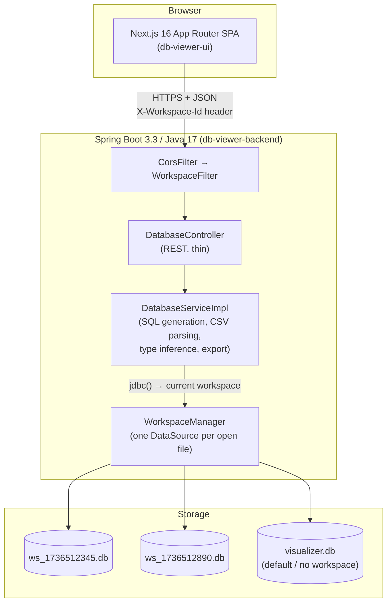
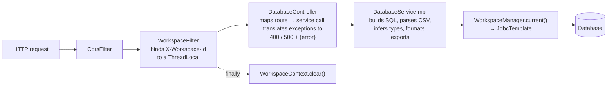
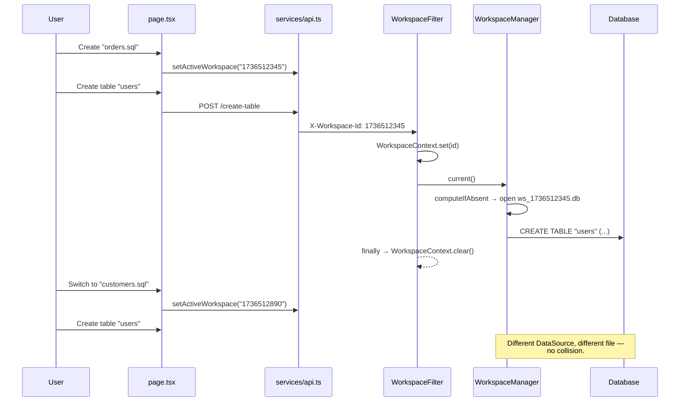
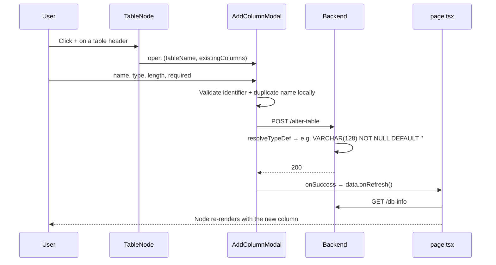
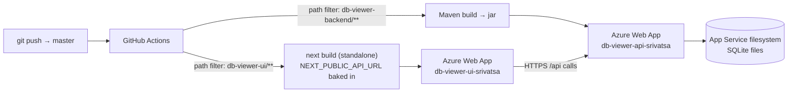
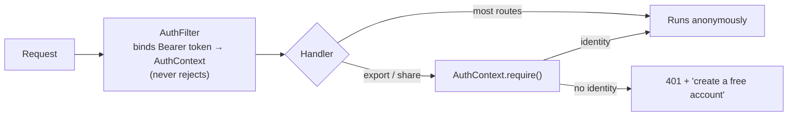

# System Design — SQL Visualizer

> Companion document: [DATABASE-DESIGN.md](./DATABASE-DESIGN.md) covers the storage layer,
> schema rules, and type mapping. This document covers everything above it — the runtime
> architecture, request flows, and deployment topology.

---

## 1. What the system does

SQL Visualizer is a two-tier web application for **exploring and editing relational data without
installing a database client**. A user drops in a `.csv` or `.sql` file (or starts from an empty
file), and the system:

1. Materialises the file's contents into a **real, queryable database**.
2. Reflects that database's schema back to the browser as an **interactive entity-relationship
   diagram**.
3. Lets the user mutate the live schema and data — create tables, add columns, insert/update/delete
   rows — with every change executed as actual SQL.
4. Exports the result back out as a CSV file (single table) or a SQL dump (whole workspace).

The important consequence of design decision (1) is that this is **not a diagram editor**. There is
no in-memory model of "a schema" that gets serialised on save. The database *is* the model; the
canvas is a projection of `PRAGMA table_info` / `INFORMATION_SCHEMA`. Every UI action is a DDL or
DML statement, and the diagram is redrawn from a fresh `GET /db-info` afterwards.

---

## 2. High-level architecture



**Tiers**

| Tier | Technology | Responsibility |
|---|---|---|
| Presentation | Next.js 16 (App Router), React 19, TypeScript strict, Tailwind v4, React Flow | Canvas rendering, file explorer, modals, optimistic UI, per-file workspace state |
| Application | Spring Boot 3.3, Spring Web MVC, Spring JDBC | REST surface, request→workspace binding, SQL generation, CSV/SQL parsing, export formatting |
| Data | SQLite (default) or MySQL 8 | Actual table storage and metadata; the single source of truth for the schema |

There is no ORM, no persistence entity layer, and no migration tooling — deliberately. The
application's whole job is to operate on schemas it does not know ahead of time, so everything goes
through `JdbcTemplate` with reflection-style metadata queries.

---

## 3. Frontend design

### 3.1 Module layout

```
db-viewer-ui/
├── app/
│   ├── layout.tsx          Root layout, JetBrains Mono via next/font
│   ├── page.tsx            ★ Owns all workspace state; the only stateful "page"
│   └── globals.css         Tailwind v4 entry + design tokens
├── components/
│   ├── header/Header.tsx           Import / refresh / export / clear / help
│   ├── editor/FileExplorer.tsx     Left tree: files → tables → columns
│   ├── editor/DataEditor.tsx       Row-level view / edit / insert / delete modal
│   ├── canvas/Visualizer.tsx       React Flow canvas + toolbar
│   ├── tables/TableNode.tsx        A single table as a graph node
│   └── modal/
│       ├── NewFileModal.tsx        Name a new (empty) SQL file
│       ├── CreateTableModal.tsx    Full table definition incl. FKs
│       ├── AddColumnModal.tsx      Single-column ALTER TABLE
│       ├── EditColumnModal.tsx     Rename / retype an existing column
│       ├── NoticeModal.tsx         Import reports: errors and warnings with details
│       ├── NewTableHelpModal.tsx   Canvas toolbar: what the New Table button does
│       └── InfoModal.tsx           "What is this" blurb + version + credits
├── services/
│   ├── api.ts              ★ The only place that talks to the backend
│   ├── sessionStorage.ts   Open files + layout, persisted across a refresh
│   └── exportImage.ts      Canvas → PNG
├── types/index.ts          Shared response/DTO types
└── hooks/useSchema.ts      Legacy hook, not on the active code path
```

### 3.2 State ownership

`app/page.tsx` is intentionally the single owner of application state. It holds:

```ts
interface Workspace {
    id: string;            // also the backend workspace id
    name: string;          // filename shown in the explorer / used for export
    nodes: Node[];         // React Flow nodes (positions survive refreshes)
    edges: Edge[];         // derived from backend relationships
    fileData: ExplorerFile;// tree projection for the explorer
    isImported: boolean;   // came from an upload vs. created empty
}
```

Child components are presentational and receive callbacks. The two exceptions — `TableNode` and
`DataEditor` — call `dbService` directly for their own mutations and then invoke an `onRefresh`
callback so `page.tsx` re-derives everything from the server. This keeps "who owns the truth"
unambiguous: **the server does**, and local state is a cache that is always thrown away and rebuilt
after a mutation.

Node **positions** are the one piece of genuinely client-side state. `refreshActiveSchema()`
deliberately preserves the existing position of any node whose table still exists, so a refresh does
not scatter a layout the user has arranged.

They are also the only thing worth persisting. `services/sessionStorage.ts` writes
`{id, name, isImported, positions}` per open file to `localStorage`; on mount the page reconciles
that list against `GET /workspaces` and re-reads each schema from `GET /db-info`. Storing ids and
layout but never the schema keeps the databases as the single source of truth — a cached schema
would be stale the moment any other call changed it.

### 3.3 The API boundary

`services/api.ts` is the single choke point for backend access. It owns:

- The Axios instance and base URL (`NEXT_PUBLIC_API_URL`, default `http://localhost:8080`).
- The **active workspace id**, applied to every request through an interceptor.
- Cache-busting `_t`/`t` query parameters on schema and table reads.
- URL builders for the two browser-initiated downloads.

```ts
let activeWorkspaceId: string | null = null;

api.interceptors.request.use((config) => {
    if (activeWorkspaceId) config.headers.set('X-Workspace-Id', activeWorkspaceId);
    return config;
});
```

Downloads are the exception that shapes the backend contract: `window.open(...)` and
`<a download>` cannot attach custom headers, so `/export/{table}` and `/export-sql` must also accept
the workspace as a `workspaceId` query parameter.

### 3.4 Rendering constraint worth knowing

React Flow applies a CSS `transform` to its viewport, and the canvas wrapper carries an
`animate-fade-up` class that also sets a transform. A transformed ancestor becomes the containing
block for `position: fixed` descendants, so **a fixed modal nested inside the canvas silently
positions itself against the canvas pane instead of the viewport.** Two mitigations are in use:

- `CreateTableModal` and `NewTableHelpModal` are rendered as *siblings* of the canvas wrapper.
  (`InfoModal` and `NoticeModal` are owned by `page.tsx`, outside the canvas entirely.)
- `AddColumnModal` and `EditColumnModal` are opened from inside a `TableNode` — unavoidably deep
  inside the transformed viewport — so they render through `createPortal(..., document.body)`,
  guarded by a `mounted` flag because `document` does not exist during SSR.

---

## 4. Backend design

### 4.1 Layering



Controllers stay thin — route, delegate, wrap the result or the error. All SQL construction,
parsing, and formatting lives in `DatabaseServiceImpl`. `GlobalExceptionHandler` covers anything
that escapes a controller's own try/catch.

### 4.2 Workspace isolation — the central design decision

**Problem.** The UI has always presented multiple open SQL files, but the backend had exactly one
datasource. Every file therefore shared one database: a `users` table created while working in
`orders.sql` appeared in `customers.sql`, and importing two files that both define `users` caused
the second import's `CREATE TABLE` to be silently skipped.

**Solution.** A workspace is a first-class backend concept, and *the file id is the workspace id*.



Key properties:

| Property | Implementation |
|---|---|
| Binding | `WorkspaceFilter` (a `OncePerRequestFilter`) reads `X-Workspace-Id`, falling back to the `workspaceId` query parameter, and binds it to a `ThreadLocal` in `WorkspaceContext` — cleared in a `finally` so pooled request threads never leak a workspace |
| Resolution | `DatabaseServiceImpl.jdbc()` calls `WorkspaceManager.current()` on every statement, so no service method needs to know workspaces exist |
| Materialisation | Lazy. `ConcurrentHashMap.computeIfAbsent` creates the DataSource on a workspace's first request; no "create workspace" call is needed |
| Isolation unit | SQLite: one `.db` file per workspace under `app.workspace.dir`. MySQL: one schema per workspace (`ws_<id>`) |
| Safety | Ids are whitelisted to `[A-Za-z0-9_-]{1,64}` before ever touching a filesystem path or a SQL identifier — path traversal and identifier injection are rejected, not escaped |
| Backward compatibility | A request with **no** workspace id uses the original default datasource, so Swagger, `curl`, health checks, and the existing test suite behave exactly as before |
| Teardown | `DELETE /workspace` closes the DataSource and deletes the file (or drops the schema); `@PreDestroy` closes everything on shutdown |

**Trade-off accepted.** Workspaces are keyed by a browser-generated id with no authentication, so any
client that knows an id can reach that workspace. This matches the app's current threat model
(a single-user developer tool). Section 8 lists what would have to change for multi-tenant use.

### 4.3 API surface

| Method | Path | Purpose | Workspace-scoped |
|---|---|---|---|
| `GET` | `/` | Health check, plus the app version | — |
| `GET` | `/version` | Version declared in `pom.xml`; shown in the UI's info modal | — |
| `POST` | `/upload` | Import `.csv` or `.sql`; returns a report of what ran and what was skipped | ✅ header |
| `POST` | `/query` | Execute raw SQL | ✅ header |
| `GET` | `/db-info` | All tables, columns, row previews, relationships | ✅ header |
| `GET` | `/table-data/{table}` | Columns + up to 100 rows | ✅ header |
| `POST` | `/create-table` | `CREATE TABLE` with PK/NOT NULL/FK | ✅ header |
| `POST` | `/alter-table` | `ALTER TABLE ... ADD COLUMN` | ✅ header |
| `POST` | `/update-column` | Rename a column, or change its type/nullability | ✅ header |
| `POST` | `/insert-row` | Insert (empty or with values) | ✅ header |
| `POST` | `/update-cell` | Update one cell by row id | ✅ header |
| `POST` | `/delete-row` | Delete one row by id | ✅ header |
| `DELETE` | `/clear` | Drop every table, keep the workspace | ✅ header |
| `GET` | `/workspaces` | Ids of workspaces that still have a database | — |
| `POST` | `/demo` | Load the bundled eight-table example | ✅ header |
| `DELETE` | `/table/{name}` | Drop a table; 409 when still referenced | ✅ header |
| `GET` `POST` `DELETE` | `/table-notes...` | Per-table to-do notes | ✅ header |
| `POST` | `/auth/signup` · `/auth/login` | Accounts | — |
| `POST` | `/share` | Create a read-only link **(account required)** | ✅ header |
| `GET` | `/share/{token}` | View a shared schema (public) | — |
| `DELETE` | `/workspace` | Delete the workspace's database outright | ✅ header |
| `GET` | `/export/{table}` | Download table as CSV | ✅ **query param** |
| `GET` | `/export-sql` | Download workspace as a SQL dump | ✅ **query param** |
| `GET` | `/swagger-ui.html` | Interactive API docs | — |

Errors are uniform: a non-2xx response carries `{"error": "<message>"}`, which the frontend surfaces
in its error modal.

---

## 5. Key request flows

### 5.1 Importing a file

```mermaid
sequenceDiagram
    participant U as User
    participant P as page.tsx
    participant B as Backend
    participant D as Workspace DB

    U->>P: Choose products.csv
    P->>P: newId = Date.now(); setActiveWorkspace(newId)
    Note right of P: Bind BEFORE upload, so the file<br/>lands in its own database
    P->>B: POST /upload (multipart)
    B->>B: Parse CSV → headers, rows
    B->>B: Infer column types per column
    B->>D: CREATE TABLE "products" (...)
    B->>D: INSERT INTO "products" ... (per row)
    B-->>P: 200 {tableName, columns, type:"csv"}
    P->>B: GET /db-info
    B->>D: sqlite_master + PRAGMA table_info + PRAGMA foreign_key_list
    B-->>P: {tables[], relationships[]}
    P->>P: transformSchemaToWorkspace → nodes + edges
    P-->>U: Canvas renders the new file
```

If the upload fails, `page.tsx` rebinds the API client to the previously active workspace so a
failed import does not strand subsequent calls against a database that was never populated.

### 5.2 Adding and editing a column



The modal validates the identifier shape and rejects a duplicate name before making the request, so
the common mistakes never reach the database. Everything else (type compatibility, table-level
constraints) is left to the database to reject, and the error message is surfaced verbatim.

**Editing** an existing column follows the same shape — a pencil on each column row opens
`EditColumnModal`, pre-filled from the backend's own metadata — but the backend work is very
different. A pure rename is one `ALTER TABLE ... RENAME COLUMN`. A type or nullability change is
`CHANGE COLUMN` on MySQL, but SQLite has no `ALTER COLUMN` at all, so the service rebuilds the
table from `PRAGMA table_info` + `PRAGMA foreign_key_list`, copies the rows across, and swaps it
into place. See
[DATABASE-DESIGN.md §7.1](./DATABASE-DESIGN.md#71-editing-a-column-the-sqlite-rebuild).

The modal sends only the fields the user actually changed, so re-saving an untouched column is a
true no-op rather than a needless table rebuild.

### 5.3 Exporting

`Header.handleExport()` builds a URL rather than fetching, because the browser must own the
download. The workspace travels as a query parameter, and the filename is derived from the open
file (`modified_` prefixed when the file was imported).

---

## 6. Cross-cutting concerns

| Concern | Approach |
|---|---|
| **CORS** | Permissive by design (`allowedOriginPatterns: *`, credentials off) — the API carries no cookies or auth |
| **Caching** | Schema and table reads append a timestamp query param; the browser is never allowed to serve a stale schema |
| **Error handling** | Controllers catch, log, and translate to `{error}` with 400 (client fault) or 500 (server fault); the frontend renders it in a modal rather than a toast, so it cannot be missed |
| **Config** | Externalised through `application.properties` with env-var placeholders (`DB_PATH`, `WORKSPACE_DIR`, `PORT`, `MYSQL_*`); profiles for `mysql` and `prod` |
| **Logging** | SLF4J via Lombok `@Slf4j`; failed SQL statements during a `.sql` import are logged and skipped rather than aborting the whole import |
| **API docs** | springdoc-openapi generates Swagger UI from the controller annotations |
| **Concurrency** | One `SingleConnectionDataSource` per SQLite workspace (SQLite's own serialisation avoids `SQLITE_BUSY`); a small Hikari pool per MySQL workspace |

---

## 7. Deployment



- Two Azure App Service Web Apps on a shared free (F1) Linux plan.
- Two path-filtered GitHub Actions workflows, so a frontend change does not redeploy the backend.
- Both authenticate with a publish profile stored as a repository secret.
- `NEXT_PUBLIC_API_URL` is a **build-time** value in Next.js — changing the backend URL requires a
  frontend rebuild, not just a restart.

**Deployment caveat.** On the F1 plan the App Service filesystem is not durable across restarts or
scale events, and there is exactly one instance. Workspace SQLite files are therefore best treated
as session-scoped: fine for the demo deployment, not a place to keep anything you care about. See
[DATABASE-DESIGN.md §9](./DATABASE-DESIGN.md#9-operational-characteristics) for the durability
discussion.

---

## 8. Known limitations and what would change at scale

| Limitation | Why it exists | What a fix looks like |
|---|---|---|
| Accounts gate export/share but are not an authorisation model | The app is meant to be usable without signing up | Record workspace ownership and check it on every workspace-scoped route, not just the two that hand data out |
| Workspace ids are guessable timestamps | Simplicity | UUIDv4 ids plus a server-side owner check |
| Workspaces are never garbage-collected unless closed in the UI | No session lifecycle | A TTL sweeper over `app.workspace.dir`, or a session-bound registry |
| SQLite files live on local disk | Zero-infrastructure default | Object storage or a managed MySQL/Postgres per tenant |
| ~~Node positions are lost on reload~~ | **Fixed** — the open-file list and canvas layout are persisted to `localStorage` and reconciled against `GET /workspaces` on start | — |
| Dragging an edge on the canvas does not persist | `onConnect` is a no-op | Map the connection to an `ALTER TABLE ... ADD FOREIGN KEY` (needs table rebuild on SQLite) |
| Row addressing assumes an `id` column | Simplifies update/delete | Use the real primary key from metadata, or `rowid` on SQLite |
| A column type change rebuilds the whole SQLite table | SQLite has no `ALTER COLUMN` | Unavoidable on SQLite; the rebuild is metadata-driven, so a hand-written CHECK/UNIQUE/COLLATE clause is not carried across |
| Columns cannot be dropped from the UI | Not requested yet | `ALTER TABLE ... DROP COLUMN` works on SQLite 3.35+ and MySQL 8 |
| Row previews capped at 100 | Keeps `/db-info` cheap | Server-side pagination on `/table-data` |
| `.sql` import skips statements it cannot run | Best-effort import of MySQL dumps | Now reported to the UI via the upload report and `NoticeModal`; MySQL triggers/procedures still have no SQLite equivalent |
| Indexes and `UNIQUE`/`CHECK` constraints in a dump are dropped | The translator folds only primary and foreign keys | Emit `CREATE INDEX` / table-level constraints during translation |

---

## 8a. Accounts and sharing



The filter deliberately never rejects: almost everything is meant to work without an account, so
the two endpoints that do need one ask for it themselves. Enforcement is server-side rather than a
hidden button, so calling the API directly does not bypass it.

**Share links** are a random 192-bit token mapped to a workspace id. Viewing one is public — the
token is the credential, which is the only way a link can be handed to someone — and read-only:
the route reads the schema and nothing else. Deleting a workspace revokes its links, so a link
never points at a database that no longer exists.

Application-owned tables (`app_users`, `shared_links`) live in the **default** database, because a
user and their links span every file. Per-table notes live *inside* the workspace as
`__table_notes` so they travel with the file; the `__` prefix is filtered out of the schema
listing, keeping it off the canvas and out of exports.

---

## 9. Testing strategy

The suite is kept deliberately small: a test earns its place only if its failure says something
no other test would. Each one asserts an effect rather than a status code, because a handler that
returns 200 without doing anything is the failure worth catching.

| Layer | Tests |
|---|---|
| REST | `DatabaseControllerIntegrationTest` — every route end to end via MockMvc: routing, binding, error status codes, workspace scoping, and what each call changed in the database |
| Workspace | `WorkspaceIsolationTest` — same table name in two workspaces, row-level leakage, default-database separation, workspace deletion, id sanitisation, MySQL URL rewriting |
| Column edit | `ColumnEditTest` — rename, retype, renullify; the SQLite rebuild preserving keys, foreign keys and data; primary-key protection; identifier validation; `PRAGMA foreign_keys` restoration |
| SQL import | `SqlImportTest` — a real phpMyAdmin dump end to end, comment-prefixed statements, semicolons inside string literals, `DELIMITER` blocks, ALTER-key folding, skip reporting |
| Auth & sharing | `AuthAndSharingTest` — signup validation, BCrypt hashing, no account enumeration, forged tokens, share create/view/revoke, anonymous refusal of export and share |
| Table lifecycle | `TableLifecycleTest` — the example schema, FK-guarded deletion, and notes staying invisible to the canvas and exports |
| Frontend | No test suite; `npx tsc --noEmit` and `npm run lint` are the gates |

All backend tests run against in-memory SQLite (`jdbc:sqlite::memory:`), including the workspace
tests, which use named shared-cache in-memory databases so isolation is exercised without touching
the filesystem.

Coverage was checked by mutation rather than by counting tests: reintroducing the `isPk` binding
bug, the SQL comment-stripping bug, and a workspace-routing bug each made the suite fail.
